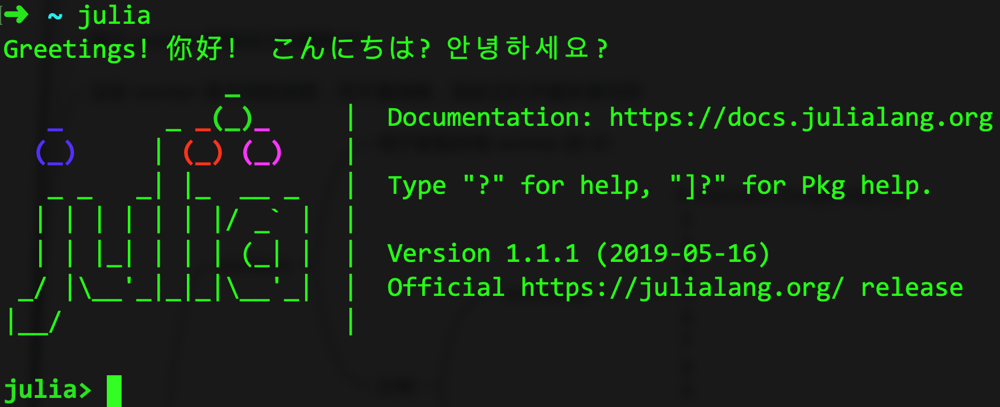

{{TOC}}

# 第 1 章 起步

## 1.1 初识 Julia

### 1.1.1 为什么要有 Julia

首先，我们要知道的是，Julia 是一门计算机编程语言。也就是说，我们可以使用符合 Julia 语言规范的代码来编写程序。这些程序可以用于纯粹的数学和科学计算、存取本地文件、通过网络收发数据，等等。虽然 Julia 针对各种科学计算任务做了特别的设计和优化，但它也适用于通用目的的编程。

科学计算往往对代码的表现力和性能都有着较高的要求。然而，一些善于科学计算的编程语言（如 Python 和 R）却都在这两个方面有所欠缺。不过，我相信它们的流行必有其原因。而且，我也很喜欢这些编程语言。它们是我的编程工具箱中必不可少的一部分，尤其是 Python。

现代语言设计和编译器技术基本上能让我们省去性能调试的工作量，并且可以提供一个单一的环境让我们打造程序原型和有效部署高性能的应用。Julia 编程语言就是在此基础之上诞生的。Julia 是一门灵活的动态编程语言，但其性能堪比传统的静态编程语言。

### 1.1.2 主要特性

Julia 拥有可选的类型标注（type annotation）、多重分派（multiple dispatch）机制，以及优良的性能。它还借由 LLVM 实现了类型推断和即时（JIT）编译。Julia 是多范式的，融入了命令式、函数式和面向对象编程的特性。Julia 为高级数值计算提供了足够的易用性和表现力。当然，Julia 也适用于通用编程。为此，它从那些流行的动态编程语言（包括 Lisp、Perl、Python、Lua 和 Ruby）中借鉴了很多。

Julia 与典型的动态编程语言之间最大的区别在于：

- Julia 的 Base 包和标准库都是由 Julia 语言编写的。这包括像整数运算那样的基本操作。也就是说，Julia 实现了一定程度的自举。
- Julia 拥有丰富的类型构造和对象描述方式，并且代码中的类型标注是可选的。
- Julia 拥有多重分派机制。它可以根据参数类型的不同去调用衍生自同一个函数定义的不同方法。并且，它还可以针对不同的参数类型自动生成有效的专用代码。
- Julia 的性能优良，并已接近那些静态编译的编程语言（如 C 语言）。

虽然那些动态编程语言从表面上看是“无类型的”，但是它们在内部却是“有类型的”。这些内部的类型一般都是在其读取代码后附加上去的。不过，由于这些语言的代码缺少类型标注，所以它们并不能向编译器明确地指示某个值的类型，甚至都不能显式地提及类型。另一方面，静态编程语言虽然可以（且必须）为编译器指示值的类型，但这些类型往往只在编译时存在，并不能在运行时操纵或表示。而在 Julia 中，类型本身就是运行时的对象。并且，这些类型也可以被用来向编译器传达信息。

我们可以不显式地使用类型标注或多重分派。但这些都是 Julia 最核心的特性，我还是建议你利用它们来改进你的代码。这样的话，你的代码的表现力会更强，并且更容易阅读。

### 1.1.3 更多的特性

Julia 的目标是成为一门易用、强大和高效的编程语言。除了上述的优点之外，Julia 相对于其他类似系统的优势还包括：

- 可供免费使用，并且开源（遵从 MIT 协议）
- 用户自定义的类型与内置的类型一样快速和紧凑
- 无需担心向量化代码的性能，被拆解后的代码速度会很快
- 已为并行计算和分布式计算做了优化设计
- 拥有轻量级的“绿色”线程（也就是协程）
- 拥有可选择使用但功能强大的类型系统
- 拥有针对于数字和其他类型的转换和提升方法，并且是优雅和可扩展的
- 有效支持 Unicode，包括但不限于 UTF-8
- 可以直接调用 C 程序中的函数，无需额外封装或者特殊的 API
- 可以管理其他进程，强大如 Shell
- 拥有类似于 Lisp 的宏，以及其他的元编程工具

顺便说一句，由于 Julia 的编译器不同于 Python 和 R 中的解释器，所以你在起初也许并不能体会到 Julia 的性能优势。如果你发现一些程序运行起来比较慢，那么我强烈建议你去阅读官方文档中的[性能秘诀](https://docs.julialang.org/en/v1.1/manual/performance-tips/#man-performance-tips-1)。一旦你理解了 Julia 是怎样工作的，那么写出性能堪比 C 程序的代码就比较容易了。

## 1.2 安装和启动

我们可以通过多种方式安装 Julia，但我建议你使用二进制安装包，因为这样最便捷。你可以从官方网站的[下载页面](https://julialang.org/downloads/)（或者国内的[镜像网站](https://cn.julialang.org/downloads/)）中下载安装包。注意，你下载的安装包应该与你所用计算机的计算架构和操作系统相对应。另外，本书讲解的版本是`v1.1.1`，所以你最好也使用这个版本。在下载完成后，你就可以双击安装包并按照提示一步步去安装了。不出意外的话，你轻点几下鼠标即可完成安装。

顺便说一下，Julia 语言的版本一般会以`vX.Y.Z`的形式表示。其中的`X`、`Y`和`Z`都只可能是正整数或者`0`。由此，`X.Y.Z`就组成了 Julia 语言的版本号（注意，不是版本）。这样的版本号遵循了 [Semantic Versioning 规范](https://semver.org)。简单来说，`X`代表主版本号（或称大版本号），`Y`代表次版本号（或称小版本号），而`Z`则代表修订版本号。另外，`X.Y`也可以被称为特性版本号。因为它的递进一般都代表着软件在特性上的更新。而最后的`Z`的递进，一般代表着软件缺陷的修复。所以它也可以被叫做 BUG 修复版本号。

言归正传。在安装完成后，你可以找到那个鲜艳的 Julia 三色图标并双击（也可以在命令行中输入`julia`并回车）。如果在当前界面中出现了类似于下图的提示内容，那么就说明你安装成功了。


_图 1-1 Julia 的初始界面_

顺便说一下，如果你想退出这个界面，那么同时按下`Ctrl`和`d`就可以了。

在使用`julia`命令的时候，我们可以追加一些启动参数。一些常用的参数有：`-e`、`-E`、`-p`和`-i`，以及`-v`和`-h`。详细说明如下。

- `-e`：用于直接对跟在后面的表达式进行求值。例如，我们可以输入`julia -e 'a = 5 * 8; println(a)'`并回车。这时，`julia`会对单引号内的表达式进行逐一求值。多个表达式之间需要以英文分号`;`分隔。第二个表达式`println(a)`在被求值时会在计算机的标准输出上打印`40`。当所有求值都完成后，`julia`命令会直接退出（返回命令行提示符）。
- `-E`：与`-e`的功能很类似。但不同的是，追加该参数的`julia`命令在退出之前还会在标准输出上打印出最后一个表达式的求值结果。上面的第二个表达式`println(a)`的求值结果会是`nothing`，表示没有结果值。
- `-p`：指定用于处理并行任务的工作进程的数量。跟在它后面的值必须是一个大于 0 的整数，或者为`auto`（指代当前计算机的 CPU 逻辑核心数）。例如，如果我们输入的命令是`julia -p 5`，那么工作进程的总数就会是`6`。这是因为 REPL 环境本身还会占用一个工作进程。如果不追加参数`-p`，那么 Julia 就不会产生额外的工作进程。
- `-i`：用于以交互模式运行命令。这意味着，命令执行后将进入 REPL（Read–eval–print loop）环境。简单来说，这个 REPL 环境就是一个可以与 Julia 的运行时系统进行即时交互的界面。比如，你在这个环境中输入`println("abc")`并回车，它立马就会回显独占一行的`abc`和一个空行。从字面上我们也可以了解到，该环境会读取你输入的表达式、求值读到的表达式、显示表达式的求值结果，然后再次等待读取。如此循环往复。如果我们在输入`julia`命令的时候没有追加任何源码文件，那么它就会以交互模式运行。
- `-v`：仅用于显示当前的 Julia 的版本。比如：`julia version 1.1.1`。
- `-h`：仅用于显示`julia`命令的具体用法。其中包括了所有可用参数的说明。

到这里，我们已经对 Julia 有了一个初步的认识。要想玩转 Julia，我们首先就应该充分熟悉`julia`命令及其 REPL 环境。不过别担心，我们后面要用到它们的地方还多着呢，你有的是机会熟悉。

## 1.3 编写第一个程序

由于 Julia 程序可以作为脚本程序来编辑和使用（就像 Shell 和 Python 那样），所以 Julia 源码文件的内容可以非常简单。你可以把脚本程序看做是以普通文本的形式保存的、实现了一定逻辑的计算机指令片段。脚本程序一般存储在一个单独的文件中，并可以由特定的工具读取和执行。比如，用 Bash（Bourne Again SHell）语言编写的脚本程序可以由`bash`工具来执行。又比如，用 Python 语言编写的脚本程序可以用`python`这个工具来执行。

脚本程序与普通程序的最大区别就是简单。它既没有高级的数据类型，也没有复杂的组织结构和流程控制，更不支持能够实现程序自我进化的元编程。而这些在 Julia 中都是存在的。因此，我们可以把 Julia 程序写得很简单，也可以把它写得很复杂。这取决于程序要实现的功能和需求，以及编写代码的人的设计风格和思考能力。

当然了，我们在初学一门编程语言的时候肯定是要从最简单的程序编写开始的。然后由浅入深，逐步地掌握它的编写方法、技巧和原理。本教程会专注于 Julia 程序的基本编写方法和技巧，并在有必要时涉及一些原理。

好了，我们现在就来编写我们的第一个 Julia 程序。我先呈现出代码再来解释。

*文件 src/ch01/hello/main.jl*

```julia
# 示例的主文件。
# - Julia version: 1.1.1
# - Author: haolin
# - Date: 2019-06-19

println("Hey, Julia!")
```

上述代码被保存在了一个单独的文件中。我们先来看这个文件的名字。`main.jl`显然由两个部分组成。这两个部分由英文句号（或称点号）`.`分割。我们一般把第一部分称为主文件名，并把第二部分称为扩展文件名。我们一般只会将代表了程序入口（或者说可以由`julia`命令直接执行）的那个源码文件命名为`main.jl`。

扩展名`jl`用于表示这个文件是一个 Julia 程序的源码文件。你可能已经看出来了，`jl`就是 Julia 的缩写。实际上，所有的 Julia 源码文件的扩展名都必须是`jl`。

这个源码文件的内容也包含了两个部分。第一部分为程序注释，第二部分为程序代码。

在 Julia 中，程序的注释可以是单行的，也可以是多行的。如果是单行的注释，我们需要以`#`作为这一行的开始。比如：`# 这是一个单行的注释`。如果是多行的注释，我们就需要显式地标示注释的开头和结尾。更具体地说，开头的标示是`#=`，结尾的标示是`=#`。并且，这两个标示通常都应该独占一行。上述源码文件中的第一部分就是这样的。

在这块注释中，我写明了这个源码文件在编写时的 Julia 版本号、作者（也就是我）的代号，以及该文件被创建时的日期。这是一种比较标准的简单写法。当然，每一个工程化的软件开发团队都会有自己的代码编写规范，其中会包含对注释风格的规定。因此，我在这里展示的只是其中的一种写法而已。不过，我建议你在编写 Julia 源码文件时一定要添加包含这几条重要信息的头部注释。

另外，我们也可以用 Markdown 格式的文本作为注释。这是 Julia 所独有的注释方式。其做法简单来说是，在一段代码（比如完整的程序定义）的开始行的上一行，写入 Markdown 格式的注释，并用三联的双引号将其包裹起来。注意，前后的三联双引号都需要独占一行。一个简单的示例如下：

```julia
"""
    get_parameter(key::String, first::Bool=true)

根据参数获取指定的命令行参数值。
参数`key`代表命令行参数的名称。参数`first`代表一种获取策略。
如果参数`first`的值为`true`，那么无论有多少个同名的命令行参数，都只获取第一个。否则只获取最后一个。
"""
function get_parameter(key::String, first::Bool=true)
```

Julia 自有一套 Markdown 注释规范。可参见 Julia 官方文档及其源码。

我们再来说文件中的第二部分。它只包含了一行代码。我在本章的第一节中展示过与之类似的代码。

这行代码实际上是一个函数调用表达式。其中的`println`是函数的名称。这个函数的功能是，向指定的输出（设备）上输送指定的内容。它常常被简称为打印函数。紧跟在它后面的、由一对圆括号包裹的内容代表了一个动作。这个动作就是“调用”。圆括号中的内容就是我们在调用这个函数时传给它的参数值。在这里，这个参数值是字符串`"Hey, Julia!"`。

你可能没有发现，我在这里并没有为它指定输出（也就是输送的目的地）。这时，指定的内容会被输送到标准输出（standard output）上。如果想指定输出的话，那么代表输出的那个参数值就应该被放到圆括号中的最左边，然后用英文逗号`,`与原先的参数值`"Hey, Julia!"`分隔开。如此就形成了一个参数值的序列，或者称之为参数值列表。例如，`println(io, "Hey, Julia!")`。其中的`io`是一个变量的名称，用于表示代表了输出的那个参数值。

好了，现在让我们使用`julia`命令来执行这个简单的程序。我们需要先进入这个源码文件所在的目录，然后这样做：

```
$ julia main.jl 
Greetings! 你好！ こんにちは? 안녕하세요?
Hey, Julia!
```

第一行最左边的`$`代表命令行提示符。它表示我们是在命令行中执行`julia`命令的。我在后面的类似场景下都会带上这个提示符。这也可以帮助你区分我们输入的命令和命令回显（或者说返回和显示）的内容。

在这里，我们输入的命令是`julia main.jl`。显然，我把上述源码文件的路径名作为参数传给了`julia`命令。该命令在收到这个参数后会立即读取相应的源码文件，并执行其中的代码。

你可能会有疑问，第二行的内容好像与我们的程序并不相关啊。的确如此。实际上，`julia`命令在启动时会先去执行一个名叫`startup.jl`的源码文件。正是其中的代码向标准输出（在这里是当前的命令行界面）输送了第二行的内容。在默认情况下，`startup.jl`文件中的代码如下所示：

```julia
println("Greetings! 你好！ こんにちは? 안녕하세요?")
```

文件`startup.jl`也被称为 Julia 的启动文件。它被保存在当前计算机的文件系统中的 Julia 配置目录下。比如，在 macOS 操作系统中，它的存放路径就是`~/.julia/config/startup.jl`。

如果你不想看到这行多余的内容，那么有两种方式可以达到目的。第一种方式，删掉`startup.jl`文件中的那行代码。第二种方式，在执行`julia`命令时追加参数`--startup-file`，并把参数值设置为`no`。比如这样做：

```
$ julia --startup-file=no main.jl
Hey, Julia!
```

这样一来，命令回显的就只剩下我们的程序所输送的内容了。

到这里，我们的第一个程序已经成功地执行了！我相信你已经对它有了足够的了解。但这只是一个开始。我们马上就要着手改进这个程序。

## 1.4 改进第一个程序

我们应该对上述程序的功能稍作改进。因为它现在只能向 Julia 打招呼，不论执行它的人是谁。我们需要让它根据执行人给定的参数值来自定义它打招呼的对象。顺便说一句，我会把这一程序的改进版本放在 *src/ch01/args* 路径下。

首先，我们要改变一下调用`println`函数时传给它的那个参数。修改后的调用表达式如下：

```julia
println("Hey, $(name)!")
```

我只改动了几个字符，即：把`Julia`改成了`$(name)`。后者代表了一个插值（interpolation）。对于插值来说，前缀`$(`和后缀`)`之间的内容可以是一个变量的名称，也可以是一个表达式。在这里，我放入的是变量`name`的名字。在`println`函数向目的地输送内容之前，它会把`name`替换成该变量在那一刻时的值。

当然，变量`name`现在还不存在。我们还需要在这行代码的前面添加一些东西。

```julia
name, _ = MyArgs.get_parameter("name", true)
if name == "" 
    name = "handsome" 
end
```

上面这 4 行代码的主要功能是定义`name`变量，并为它赋予合适的值。第一行中的`MyArgs`代表了一个模块。而表达式`MyArgs.get_parameter("name", true)`则代表了对这个模块下的函数`get_parameter`的一次调用。在调用时，我们传给了它两个参数值，即：`String`类型（也称字符串类型）的值`"name"`和`Bool`类型（或者说布尔类型）的值`true`。

这里的模块代表的是一块程序。原则上讲，这块程序可以包含任意行的代码。我一会儿再说怎么定义一个模块。现在你只需要知道，在我们调用`MyArgs.get_parameter`函数后，它会返回两个结果值。在同一行中，我把这两个结果值分别赋给了变量`name`和`_`。

符号`=`代表了“赋值”这个动作。这意味着，它右边的表达式所产生的结果值会被赋给左边的变量。注意，左边的结果值的数量和右边的变量的数量必须相同。在这里，它们的数量都是两个。

你可能会问：`_`是什么？它实际上是一个占位符。你可以把它想象成一个垃圾桶。当我们不再需要某个值的时候，就可以把它扔进（赋给）这个垃圾桶。这么做一般有两个原因。其一，让 Julia 的垃圾收集器及时地回收这个不再被使用的值所占用的内存空间。其二，保持程序的完整性和可读性。换句话说，即使一个值或者一个变量不再有用了，我们也要进行妥善的处理。

所谓的垃圾收集器是指，用于自动地收集和清扫内存垃圾的内置程序。大多数现代编程语言都会提供垃圾收集器。简单来说，当用户程序中的一些代码以及它们产生的数据不再有用的时候，垃圾收集器就会识别它们，并把它们所占用的内存空间收回，以便重复利用或者还给操作系统。

再说回我们的程序。我们在第一行代码中调用了`MyArgs.get_parameter`函数，并用它返回的第一个结果值为`name`变量赋了值。紧随其后的，是一个由`if`语句构成的代码块。

```julia
if name == "" 
    name = "handsome" 
end
```

`if`语句用于有条件地执行代码。它以关键字`if`作为起始，并以关键字`end`作为末尾。在`if`右边的就是一个条件，即：`name == ""`。这是一个判等表达式。它判断的是变量`name`的值是否与空字符串`""`相等。

在我们的设计中，如果我们在执行这个程序的时候没有通过参数指定一个问候对象的名字，那么这里的`name`变量的值就会是`""`。因此，这个`if`语句代表的逻辑就是，如果我们没有指定问候对象的名字，那么就把`name`变量的值设置成`"handsome"`。

记住，在`if`关键字和条件代码的下一行就是满足条件时需要执行的代码。当然，这样的代码可以有多行。但不管怎样，这些代码都需要被缩进。也就是说，它们要比包含了`if`关键字的那一行代码更靠右一些。一般情况下，我们需要在这些代码的左边插入固定数量（比如 4 个）的空格或者一个制表位。

还要注意，关键字`end`与关键字`if`是左对齐的。并且`end`是需要独占一行的。这个关键字在 Julia 程序中是非常常用的。它通常作为一个代码块的结束标识。比如，我们在写模块、函数、`if`语句、`for`语句、`try...catch`语句等等代码块时都会用到它。

再来说`MyArgs`模块。我在改进版本的`main.jl`的开始处定义了这个模块。代码如下：

```julia
module MyArgs

include("args.jl")

end
```

它由关键字`module`、模块名称`MyArgs`、关键字`end`，以及被夹在中间的代码组成。注意，在模块的定义中，首尾两行之间的那些代码可以不缩进。这主要是考虑到整个文件的内容只包含一个（或寥寥几个）模块定义的情况。在这种情况下，如果中间的代码都缩进，那么就等于几乎所有的代码都要缩进了。这个工作量往往是没必要的，而且这样的代码也是不美观的。

在我们的`MyArgs`模块的中间只有一行代码。它也是一个表达式，代表了对`include`函数的调用。这个`include`函数接受一个字符串类型的参数，而且这个参数的值需要代表一个 Julia 源码文件的路径名。简单来说，它会把参数值指定的源码文件的内容复制、黏贴到调用它的代码那里。也可以说，它会用我们指定的源码替换掉调用它的那行代码。

我们在这里传给`include`函数的参数值是`"args.jl"`。这个源码文件与改进版本的`main.jl`处在同一个目录下，即：*src/ch01/args*。我在该文件中定义了一个名叫`get_parameter`的函数。这个函数的定义细节我就不讲了，你可以自己去看。其中只包含了寥寥几行代码，用于变量定义、函数调用、条件求值等。

那里有一些语法我们还没有讲，所以你看不懂也没关系。但是，我希望你在看过之后记录下自己有疑问的地方，并且带着这些疑问阅读本教程的后续部分。

现在让我们执行一下改进版本的`main.jl`文件吧：

```
$ julia --startup-file=no main.jl --name=Robert 
Hey, Robert!
```

我在这次执行`julia`命令的时候给了它三个参数。这些参数之间是由空格分隔开的。第一个参数是我们已经熟知的`--startup-file`。而第二个参数是我要执行的源码文件。在它之后就是我为源码文件提供的参数了。

在第三个参数中，我以`--`为前缀。这主要是为了遵从`julia`命令的参数形式。紧跟在`--`之后的就是参数名`name`、等于号`=`和参数值`Robert`。因此，程序回显的内容就是`Hey, Robert!`。这是正确的。你可以改变一下第三个参数的值，然后看看效果。

## 1.5 小结

在本章，我们先讲了一下 Julia 语言诞生的初衷。然后，我们对它的一些特性进行了略有侧重的说明。Julia 语言中比较亮眼的特性有：可选的类型标注、多重分派机制、多种并行计算方式、元编程的支持、接近 C 语言的性能，等等。

在简要介绍了 Julia 语言的安装以及`julia`命令的使用之后，我们立即开始了第一个 Julia 程序的编写。在经过一番改进之后，我们的第一个程序就成功实现了一个小功能，即：根据我们执行程序时给定的参数值，打印一句简单的问候。

到这里，作为初识 Julia 语言的读者，我觉得你已经知道的够多了。在下一章，我将会着重介绍 Julia 程序的编程环境。这些也是我们在正式地编写 Julia 程序之前很有必要了解的知识。
