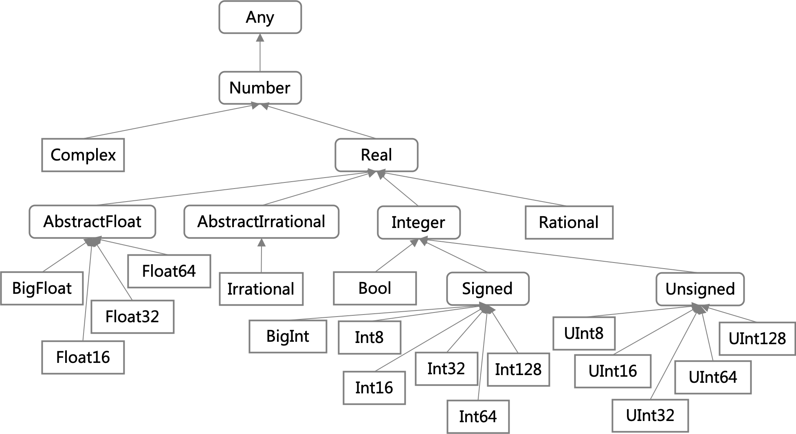

{{TOC}}

# 第 4 章 类型系统

在 Julia 中，任何值都是有类型的。可见，与值一样，类型也散布在 Julia 程序的每一个角落。

我们都知道，计算机编程语言大体上可以分为两类。一类是以 C、Java、Golang 为代表的静态类型语言，另一个类是以 Python、Ruby、PHP 为代表的动态类型语言。

所谓的静态类型语言是指，在通常情况下，程序中的每一个变量或表达式的类型在编写时就要有所说明，最迟到编译时也要被确定下来。另外，变量的类型是不可以被改变的。或者说，一个变量只能被赋予某一种类型的值。虽然在有的编程语言（如 Golang）中，变量的类型可以被声明为某个接口类型，从而使其值的类型可以不唯一（只要是该接口类型的实现类型即可），但这终归是有一个非常明确的范围的。

动态类型语言与之有着明显的不同。这类语言中的变量的类型是可变的。或者说，变量的类型会随着我们赋予它的值的类型而变化。这种变化可以说是随心所欲的。它给程序带来了极大的灵活性，但同时也带来了很多不稳定的因素。这主要是由于某些操作只能施加在某个或某种类型的值之上。比如，对于数值类型的值才有求和一说。又比如，只有字符类型和字符串类型的值才能进行所谓的拼接。一旦变量所代表的值与将要施加的操作不匹配，那么程序就会出现异常，甚至崩溃。为了谨慎对待此类错误，我们往往不得不在程序中添加很多额外的错误检测和处理代码。这无疑会加重我们的心智负担。

那些静态类型语言的编译器可以帮助我们检查程序中绝大多部分的类型错误。同时，固化类型的变量也可以让程序跑得更快。不过，这肯定会让我们在写程序时多编写一些代码，包括对变量类型进行声明的代码，以及对不同类型的值实现同一种操作的代码。后一种代码可以被称为多态性代码。

如果多态性代码可以由编程语言提供的一些工具简化，而不用我们完全手动编写，那么就可以说这种编程语言是支持多态的。绝大多数动态类型语言都是支持多态的。其代码几乎都可以自动地成为多态性代码。这也主要得益于其变量类型的可变性。而一些静态类型语言也可以通过一些手段（比如方法重载和泛型）在一定程度上支持多态。

## 4.1 概述

严格来说，Julia 属于动态类型语言。或者说，Julia 的类型系统是动态的。但是，我们却可以为变量附加类型标注，以使它的类型固化。虽然有些传统的动态类型语言（比如 Python）也可以为变量添加类型信息，但那最多也只能算是一种注释，并不属于其类型系统的一部分。相比之下，一旦我们为 Julia 程序中的变量添加了类型标注，那么`julia`命令就可以在程序真正运行之前检测出并及时报告类型不兼容的赋值。

### 4.1.1 三个要点

如果只用三个词来概括 Julia 的类型系统的话，那么就应该是动态的（dynamic）、记名的（nominative）和参数化的（parametric）。

我们已经解释过什么叫做“动态的”。简单来说就是，变量的类型是可以被改变的。如果我们不为变量添加类型标注，那么只有到了程序运行的时候，Julia 才能知道该变量的类型是什么。

所谓的“记名的”是指，Julia 中的每一个类型都是有名称的。并且，即使两个类型的含义和结构都是相同的，只要它们的名称不同，那么它们就是两个不同的类型。另外，类型之间的层次关系一定是有显式的声明的。例如，`Int64`类型的定义是这样的：

```julia 
primitive type Int64 <: Signed 64 end
```

这里应该重点关注的是`Int64 <: Signed`。操作符`<:`的含义是，其左侧的类型是其右侧类型的直接子类型。因此，`Int64`类型是`Signed`类型的直接子类型，或者说`Int64`类型直接继承了`Signed`类型。当然，两个类型之间的关系也可以是间接的。例如，`Signed`类型的定义如下：

```julia
abstract type Signed <: Integer end
```

因此我们可以说`Int64`类型是`Integer`类型的间接子类型。

对于类型的参数化，我们也多次提到过。还记得我们在上一章定义过的那个`Ref{UInt32}`类型的常量吗？Julia 中的参数化类型（如`Ref{T}`）类似于其他一些编程语言（比如 Haskell、Java 等）中的泛型。不过，各种编程语言实现泛型的方式都会有所不同，最起码在实现细节上都会有自己的特点。对于 Julia 来说更是如此，别忘了它可是动态类型的编程语言。

我们会在后面专门讲类型的参数化。你现在只需要知道，参数化类型相当于一种对数据结构的泛化定义。更具体地说，我们可以借此在不指定具体类型的情况下用代码去描绘泛化的（或者说更加通用的）数据结构和算法。

### 4.1.2 一个特点

Julia 类型系统的最大特点当属它的多重分派机制。正因为有了多重分派机制，Julia 才能够对多态提供强大的支持。

当我们没有为变量或参数添加类型标注的时候，原则上它们可以被赋予任何类型的值。至于后续的操作是不是支持这样的值，那就需要以多重分派的结果为准了。例如，有这样一个函数`sum1`：

```julia
julia> function sum1(a, b)
           a + b
       end
sum1 (generic function with 1 method)

julia> 
```

注意，在`function`和`end`之间的代码就是我们对`sum1`函数的定义。该函数的功能显而易见。它有两个参数`a`和`b`，并且都没有类型标注。在这种情况下，我们使用两个整数值、两个浮点数值或者一个整数值及一个浮点数值作为参数值调用它都是可以的：

```julia
julia> sum1(1, 2)
3

julia> sum1(1.2, 2.3)
3.5

julia> sum1(1.2, 4)
5.2

julia> 
```

这是由于 Julia 的多重分派机制根据在操作符`+`两侧的值的类型，把相加的操作委派给了不同的内部代码（操作符`+`实际上也代表着一个函数，且针对其参数类型的不同还有着很多衍生方法）。这就自动地让我们的代码成为了多态性代码，即：对不同类型的值实现同一种操作的代码。

即使我们为`sum1`函数的参数添加了类型标注，情况也是类似的。我们可以对这个函数稍加改造：

```julia
julia> function sum1(a::Real, b::Real)
           a + b
       end
sum1 (generic function with 2 method)

julia> 
```

这里的`Real`代表了实数类型，同时它也属于抽象类型。简单来说，抽象类型代表着一个类型范围。比如，我们之前讲过的`Int64`、`UInt32`以及未曾碰到过的`Float32`、`Float64`都在`Real`这个范围之内。这与数学中的概念是一样的，即：整数和浮点数都属于实数。

因此，即便是在这样的类型约束之下，我们在前面写的那几种调用方式也依然是有效的。也即是说，`sum1`函数在如此的类型约束下仍然是多态的。

注意，我们到这里已经拥有了两个名为`sum1`的函数。更确切地说，这两个定义代表的都是`sum1`函数的衍生方法。第一个`sum1`函数的参数类型都是`Any`（我们稍后会讲到这个类型），而第二个`sum1`函数的参数类型都是`Real`。相比于前者，后者对参数的类型有了一定的约束。Julia 会根据我们调用这个函数时给予的参数值的类型来选择具体使用哪一个衍生方法。这依然是多重分派机制在起作用。别担心，你现在对此不理解并没有关系。我们会在后面用一章专门讲解函数、方法以及 Julia 的多重分派机制。对于抽象类型，我们在后面也会详细论述。

你现在只需要知道，类型标注和多重分派机制都已经被内置在了 Julia 的类型系统中，并且它们都是这个系统的核心功能。它们能够帮助我们产出富有表现力且可高效运行的代码。由于它们的共同作用，我们的代码才可以在各种约束之下灵活地实现多态。

## 4.2 类型与值

我们在前面提到了子类型（subtype）这个概念。与之相对的概念是超类型（supertype）。比如说，`Integer`类型是`Signed`类型的直接超类型，并且还是`Int64`类型的间接超类型。如果用操作符`<:`来表示的话，那就是：`Int64 <: Signed <: Integer`。

实际上，Julia 中预定义的所有类型共同构成了一幅具有层次的类型图。这幅类型图中的类型之间都是有关系的。更具体地说，它们要么存在着直接或间接的继承关系，要么有着共同的超类型。

每一个 Julia 程序都会使用甚至定义一些类型。正因为如此，我们的程序才与 Julia 的类型系统关联在了一起。可以说，我们在编写程序时总会使用到 Julia 的类型图，并且有时候（即在自定义类型时）还会对这幅图进行扩展。我们定义的所有类型都会有一个超类型，即使我们没有显式地指定它。如此一来，我们的类型就与 Julia 原有的类型图联系在一起了。

我们之前说过，Julia 代码中的任何值都是有类型的。或者说，Julia 程序中的每一个值都分别是其所属类型的一个实例。不仅如此，每一个值也都分别是其所属类型的所有超类型的一个实例。例如：

```julia
julia> 10::Int64, 10::Signed, 10::Integer
(10, 10, 10)

julia> 
```

可以看到，上例中的 3 个类型断言都成功了。也就是说，`10`这个值既是`Int64`类型的一个实例，也是`Signed`类型和`Integer`类型的一个实例。

此外，Julia 代码中所有的值都是对象（object）。但与那些传统的支持面向对象编程的语言不同，Julia 中的对象（或者说这些对象所属的类型）并不会包含或关联任何方法。恰恰相反，一个函数会用它的衍生方法去尽量适应被操作的对象。这正是由 Julia 的多重分派机制来控制的。

再次强调，Julia 中只有值才有类型，而变量本身是没有类型的。一个变量代表的只是一个标识符与某个值之间的绑定关系。

## 4.3 两个特殊类型

### 4.3.1 Any 类型

在 Julia 的类型图中，`Any`是一个唯一的顶层类型。如果说超类型在上、子类型在下的话，那么它就处在类型图的最顶端。`Any`类型是所有类型的直接或间接的超类型。也就是说，对于任意类型的变量`x`，类型断言`x::Any`都必定是成功的。

还记得吗？我们在前面定义第一个`sum1`函数的时候，并没有为它的两个参数指定类型。然而，在这种情况下，这两个参数实际上都会有一个缺省的类型，即：`Any`类型。这也是为什么我们可以用任何类型的值作为参数值调用这个`sum1`函数的原因。

再比如，我们可以定义如下的原语类型（我们稍后会讲到这种类型）：

```julia
julia> primitive type MyWord 64 end

julia> 
```

注意，我们没有显式地指定它的超类型。然而，在这种情况下，`MyWord`类型会有一个缺省的超类型，同样是`Any`类型。也就是说，这个`MyWord`类型是`Any`类型的直接子类型。

更宽泛地讲，`Any`类型会在很多情况下担当默认类型并发挥其作用。我们在后面还会遇到类似的情形。另外，`Any`类型是一个抽象类型。因此它本身是不能被实例化的。但所有的值却都是它的实例。

### 4.3.2 Union{} 类型

在 Julia 的类型图中，还有一个与`Any`完全相对的类型。它就是`Union{}`类型。由于这个类型是所有类型的子类型，所以它是一个底层类型，并且也是唯一的一个。它处在类型图的最底端。也就是说，对于任意类型的变量`x`，类型断言`x::Union{}`都必定是失败的。另外，与`Any`一样，`Union{}`也是一个抽象类型。

从字面上我们就可以看出，`Union{}`是一个被参数化的类型。它的源类型是`Union{Types...}`类型，其中的`Types...`代表任意个类型参数。如果这里有多个类型参数，那么它们之间需要用英文逗号分隔开。

这个`Union{Types...}`类型有着一种很特殊的用途。我们可以利用它，让一个单一的类型字面量代表多个类型。换句话说，把多个类型联合在一起形成一个类型，并让后者作为前者的统一代表。因此，我们也可以把这个类型称为联合类型。而每一个类型参数的组合都可以代表一种联合类型。示例如下：

```julia
julia> IntOrString = Union{Integer, AbstractString} 
Union{AbstractString, Integer}

julia> 2020::IntOrString
2020

julia> "2020"::IntOrString
"2020"

julia> 
```

类型`Union{Integer, AbstractString}`表示的是`Integer`类型和`AbstractString`类型的联合。因此，任何`Integer`类型或`AbstractString`类型的实例都可以被视为这个联合类型的实例。这就是类型断言`2020::IntOrString`和`"2020"::IntOrString`可以成功的原因。

另外，由于 Julia 中的类型属于一类特殊的值（`DataType`类型的值），所以上述的联合类型自然也就可以与标识符`IntOrString`绑定在一起。这时，我们可以说`IntOrString`是那个联合类型的别名（alias）。

搞清楚了联合类型以及它的用途，我们就很容易理解“`Union{}`类型处在类型图的最底端”的原因了。由于它的花括号中没有任何类型参数，所以这种联合类型也就代表不了任何类型，相当于一个“虚无”的类型。而任何类型都比“虚无”包含了更多的东西，所以它们都是这种联合类型的超类型。如果我们使用操作符`<:`在这些类型之间做判断的话，就可以很形象地看到这种关系：

```julia
julia> Union{} <: Integer
true

julia> Union{} <: Union{Integer}
true

julia> 
```

此示例中的两个表达式的结果值都是`true`。这说明整数类型`Integer`和联合类型`Union{Integer}`都是“虚无”类型`Union{}`的超类型。

至此，我们已经较为充分地了解了 Julia 类型图中的两端，即：最顶端的`Any`和最底端的`Union{}`。下面，我们一起来看看在它们之间的类型都有哪些。

## 4.4 三种主要类型

如果以是否可以被实例化来划分的话，Julia 中的类型可以被分为两大类：抽象类型和具体类型。而具体类型还可以再细分。我们先从抽象类型说起。

### 4.4.1 抽象类型

抽象类型不能被实例化。正因为如此，抽象类型只能作为类型图中的节点，而不能作为终端。如果把类型图比喻成一棵树的话，那么抽象类型只能是这棵树的树干或枝条，而不可能是树上的叶子。即使是`Union{}`这个特殊的底层类型，也无法成为叶子并与一般的值和变量扯上关系。

有了抽象类型，我们就可以去构造自己的类型层次结构。比如，由`AbstractString`类型延伸出一些特殊的字符串类型，以便适配一些具体的情况。又比如，从直接继承自`Any`的某个类型开始，一步步构建和扩展我们自己的类型（子）图，从而描绘出一个面向某个领域的数据类型体系。

另外，抽象类型让我们在编写数据结构和算法时不必指定具体的类型。在很多时候，具体类型就意味着严格的限制。这可能会让程序更加稳定，但也可能会使程序失去必要的灵活性。当有了抽象类型和类型层次结构，我们就可以根据自己的需要去权衡稳定性与灵活性之间的关系了。我们在前面编写的那个`sum1`函数就是一个很好的例子。

下面，我们一起来看看怎样定义一个抽象类型。这种定义的一般语法是这样的：

```julia 
abstract type <类型名> end 
```

或

```julia
abstract type <name> <: <超类型名> end
```

注意，其中的成对尖括号及其包含的内容是需要我们替换掉的。

这里有两种形式。它们都以多词关键字`abstract type`开头，并后接类型的名称。不同的是，第一种形式没有显式地指定它的超类型，而直接以`end`结尾了。在这种情况下，这个被定义的类型的超类型就是`Any`。而第二种形式在类型名和`end`之间插入了操作符`<:`和超类型名。我们之前说过，这个操作符在这里表示“A 直接继承自 B”，或者说“A 是 B 的直接子类型”。其中 A 代表该操作符左侧的类型，而 B 则代表操作符右侧的类型。

我们在前面展示过的抽象类型`Signed`的定义使用的就是第二种形式。`Signed`类型直接继承了`Integer`类型：

```julia
abstract type Signed <: Integer end
```

如果我们把焦点扩散开来，就会发现这只是数值类型层次结构中的一小段。下面是数值类型子图的示意。


_图 4-1 数值类型的层次结构_

图中由圆角矩形包裹的类型都是抽象类型，而由直角矩形包裹的类型都是具体类型。再次强调，只有具体类型（如`Float32`、`Bool`、`Int64`等）才可能被实例化，而抽象类型（如`Real`、`Integer`、`Signed`等）一定不能被实例化。不过一个值却可以是某个抽象类型的实例。比如，`10`这个值就是`Signed`、`Integer`和`Real`类型的实例。原因是这几个抽象类型都是具体类型`Int64`的超类型。

我们可以说，抽象类型就是 Julia 类型图中的支柱。没有它们，整个类型层次结构就不复存在。其根本原因是，具体类型不能像抽象类型那样被继承。也就是说，具体类型只能是类型图中的终端或树上的叶子。

顺便提一句，我们可以使用`isabstracttype`函数来判断一个类型是否属于抽象类型，还可以用`isconcretetype`函数判断一个类型是否属于具体类型。显然，对于同一个类型，这两个函数总会给出相反的结果。

### 4.4.2 原语类型

原语类型是一种具体类型。它的结构相当简单，仅仅是一个扁平的比特（bit）序列。我们在前面提到的数值类型中有很多都属于原语类型，具体如下：

- 浮点数类型：`Float16`、`Float32`和`Float64`
- 布尔类型：`Bool`
- 有符号整数类型：`Int8`、`Int16`、`Int32`、`Int64`和`Int128`
- 无符号整数类型：`UInt8`、`UInt16`、`UInt32`、`UInt64`和`UInt128`

除此之外，`Char`类型也属于原语类型。所以，Julia 预定义的原语类型一共有 15 个。

原语类型的定义方式与抽象类型的很相似。只不过它以多词关键字`primitive type`开头，而不是以`abstract type`开头。我们之前提到过`Int64`类型的定义，它是这样的：

```julia 
primitive type Int64 <: Signed 64 end
```

注意，在这个定义的超类型名`Signed`和关键字`end`之间有一个数字`64`。这个数字代表的就是该类型的比特序列的长度。或者说，它代表的是该类型的值需要占据的存储空间的大小，单位是比特。为了与值的显示长度区分开，我们通常把这个数字称为类型的宽度。实际上，这里的宽度已经体现在`Int64`类型的名称中了。

由此，我们可以得知，`Int8`与`UInt8`的宽度是相同的，`Int16`与`UInt16`的宽度也是相同的。以此类推。虽然宽度相同，但由于它们的名称不同，所以还是不同的类型。更何况，它们的含义也是不一样的。

`Bool`类型和`Char`类型的宽度都没有体现在名称上。但通过其含义，我们可以倒推出它们的宽度。`Bool`是用于存储布尔值的类型。布尔值总共才有两个，即：`true`和`false`。因此按理说使用一个比特来存储就足够了。但由于计算机内存的最小寻址单位是字节（即 8 个比特），更小的存储空间既不利于内存寻址也无益于性能优化，所以布尔值最少也要用 8 个比特来存储。至于`Char`，它的值代表单个 Unicode 字符。由于一个 Unicode 字符最多也只会占用 4 个字节，所以把`Char`类型的宽度设定为 32 个比特就足够了。

顺便说一下，如果我们想在程序中获得一个类型的宽度，那么可以使用`sizeof`函数，就像这样：

```julia
julia> sizeof(Bool)
1

julia> sizeof(Char)
4

julia> 
```

该函数会返回一个`Int64`类型的结果值。但要注意，从这里得到的类型宽度的单位是字节，而不是比特。

与很多其他的编程语言都不同，Julia 允许我们定义自己的原语类型。如此一来，我们就可以在一个固定大小的空间中存放自己的比特级数据了。例如，我们可以定义这样一个原语类型：

```julia
primitive type MyUInt64 <: Unsigned 64 end
```

原语类型`MyUInt64`直接继承自`Unsigned`类型，所以它的值可以被用来存储无符号整数。又因为它的宽度是`64`，所以其值需要占据的存储空间是 8 个字节。

不过，要想让这个类型真正实用，我们还需要编写更多的代码。对于这些代码，你目前阅读起来可能会有些难。所以我把它们存放到了相对路径为`src/ch04/primitive/main.jl`的源码文件中。如果你现在就对此感兴趣，可以打开这个文件看一看。其中的注释会帮助你更好地理解代码。

### 4.4.3 复合类型

复合类型也是一种具体类型。它的结构可以很简单，也可以相对复杂。这完全取决于我们的具体定义。我们可以在定义一个复合类型的时候为它添加若干个有名称、有类型的字段，以满足我们对数据结构的要求。这里的字段也是由一个标识符代表的。它与变量很类似，只不过它只能存在于复合类型的内部。对于一个复合类型的字段，我们只能通过其实例才能访问到。

在 Julia 中，复合类型是唯一一种可以由我们完全掌控的类型，同时也是最常用的一种类型。很多编程语言也都有类似的类型。有的语言把它的实例称为对象，而有的语言把它的实例称为结构体。在这里，为了体现这种类型的特点，我们把 Julia 中的复合类型的实例也称为结构体（但它们也都是对象）。在一些编程语言中（比如 Java 和 Golang），每个复合类型都可以关联一些方法。而在 Julia 中，复合类型是不可以关联任何方法的。对此，我们已经在前面有所提及。这种设计可以让程序变得更加灵活。

#### 4.4.3.1 定义

复合类型的定义需要由关键字`struct`开头，并且再加上一个类型的名称作为第一行。与其他的很多定义一样，复合类型的定义也需要以独占一行的`end`作为结尾。下面是一个简单的例子：

```julia
julia> struct User
           name::String
           reg_year::UInt16
           extra
       end

julia> 
```

我定义了一个名为`User`的类型。它包含了 3 个字段，分别是`name`、`reg_year`和`extra`。每个字段的定义都独占一行。其中，`name`代表姓名，是`String`类型的，而`reg_year`代表注册年份，是`UInt16`类型的。至于`extra`，我打算用它来存储一些额外的信息，具体是什么我现在还不能确定。所以我没有为这个字段添加类型标注。这样的话，这个字段的类型将会是`Any`类型。也就是说，我可以赋给它任何类型的值。

#### 4.4.3.2 实例化

复合类型的实例化需要用到构造函数（constructor）。不过，我们并不用自己手动编写，这与原语类型一样。一个使用示例如下：

```julia
julia> u1 = User("Robert", 2020, "something")
User("Robert", 0x07d0, "something")

julia> 
```

可以看到，构造函数是与对应的类型同名的，并且我是按照`User`类型中字段定义的顺序来为构造函数传入参数值的。

Julia 会为每一个复合类型都自动生成两个构造函数。它们也被称为默认的构造函数。第一个构造函数的所有参数都一定是`Any`类型的，我们称之为泛化的构造函数。这种构造函数可以让我们用任何类型的参数值去尝试构造`User`类型的实例。不过，这不一定会成功。原因是，当参数类型不匹配时，Julia 会尝试使用`convert`函数把参数值转换成对应字段的那个类型的值。如果这种转换失败，那么对复合类型的实例化也将失败。例如：

```julia
julia> u2 = User("Robert", 2020.1, "something")
ERROR: InexactError: UInt16(2020.1)
# 省略了一些回显的内容。

julia> 
```

在复合类型的第二个默认的构造函数中，每一个参数的类型都一定会与对应字段的类型一致。这个函数中不会有任何的参数类型转换。如果像下面这样调用，就一定会用到该函数：

```julia 
julia> u2 = User("Robert", UInt16(2020), "something")
User("Robert", 0x07d0, "something")

julia> 
```

真的是这样吗？空口无凭，我们怎么验证这种规则呢？这就需要用到一个名叫`@which`的宏了。至于什么是宏，你现在可以简单地把它理解为一种特殊的函数。它可以像操纵数据那样去操纵代码。我们在使用宏的时候需要在其名称之前插入一个专用的符号`@`。拿`@which`来说，这个宏的本名其实是`which`。

怎样使用`@which`宏呢？很简单，我们可以把前面示例中的等号右边的代码作为参数值传给它，就像这样：

```julia
julia> @which User("Robert", UInt16(2020), "something")
User(name::String, reg_year::UInt16, extra) in Main at REPL[1]:2

julia> 
```

可以看到，我只用空格分隔了宏名称和它的参数值。我们当然也可以像调用普通函数那样用圆括号包裹住参数值。但由于这里传入的是一段代码，所以为了清晰我选用了第一种方式。

我们现在来看 REPL 环境回显的内容。显然，`User(name::String, reg_year::UInt16, extra)`正是我们在前面描述的第二个默认的构造函数。它的每个参数的类型都与对应字段的类型相一致。前面那句话由此得到了证实。

相对应的，当我们给`u1`赋值时，等号右边的代码实际上调用的是第一个默认的构造函数。证据如下：

```julia 
julia> @which User("Robert", 2020, "something")
User(name, reg_year, extra) in Main at REPL[1]:2

julia> 
```

关于复合类型的构造函数，我们就先介绍到这里。在后面讲函数和方法的时候，我们还会说到它。另外，在本教程的最后一部分，我们还会专门讨论宏和元编程。

#### 4.4.3.3 字段的访问

我们再来说一下字段的访问方式。我在刚开始讲复合类型的时候说过：只有通过其实例才能访问到其中的字段。那具体应该怎样做呢？

其实很简单，通过一个英文点号就可以做到。这个英文点号在这里被称为选择符。我们可以用它来选择复合类型实例中的某个字段。示例如下：

```julia 
julia> u2.name
"Robert"

julia> Int16(u2.reg_year)
2020

julia> 
```

这里的代码`u2.name`也常被称为选择表达式。注意，虽然我们可以像上面那样访问到`u2`的字段，但是却不能用这种方式修改它们的值：

```julia
julia> u2.name = "Eric"
ERROR: setfield! immutable struct of type User cannot be changed
# 省略了一些回显的内容。

julia> 
```

依据错误信息，我们得知这个`User`类型的结构体竟然是不可变的！没错，我们定义的所有复合类型的实例都是不可变的。你会觉得这很不合常理吗？虽然不同于其他的一些编程语言的做法，但这样做是非常有好处的。具体如下：

1. 提高了程序的安全性。我们完全不用担心因操作失误而造成的数据更改。尤其是在与其他的代码共享数据的时候。在其他的编程语言中，我们往往需要通过控制访问权限来做到这一点。
2. 提高了程序的性能。Julia 对不可变的实例会有很多优化的手段。比如，当它们在函数间传递的时候并不会造成多余的内存分配。因为对于不可变的值，通常只存一份就足够了。
3. 可以减少我们的心智负担。这很好理解，我们肯定不用担心一个不可变的值会在某个时刻突然发生变化。而且，我们可以完全确定，一个复合类型的所有实例都是不可变的。这可以省去不少用于检查的代码。

不过要注意，虽然复合类型的实例本身是不可变的，但如果它包含了某种可变类型（比如数组）的字段，那么它还是可以被改变的。复合类型的实例本身只能保证，可变类型的字段始终只会引用同一个可变值。关于这一点，我们需要在定义复合类型的时候就考虑清楚。

#### 4.4.3.4 可变的复合类型

Julia 当然允许我们定义可变的复合类型。定义的方式与通常的复合类型定义非常相似。只需要把单词关键字`struct`替换为多词关键字`mutable struct`就可以了。显然，其中的“mutable”是唯一的关键。

例如，我们可以定义一个可变的复合类型`Person`，然后构造一个此类型的实例，并随意地修改其中的字段值。代码如下：

```julia
julia> mutable struct Person
           name::String
           age::UInt8
           extra
       end

julia> p1 = Person("Robert", 30, "something")
Person("Robert", 0x1e, "something")

julia> p1.age = 37
37

julia> Int8(p1.age)
37

julia> 
```

此外，可变的复合类型与不可变的复合类型还有一个很重要的不同，那就是：

- 对于可变的复合类型，即使两个实例中对应字段的值都相同，这两个实例也是不同的。例如：

  ```julia
  julia> p2 = Person("Robert", 37, "something"); p1 === p2
  false
  
  julia> 
  ```

- 对于不可变的复合类型，只要两个实例中对应字段的值都相同，这两个实例就是相同的。例如：

  ```julia
  julia> u1 === u2
  true
  
  julia> 
  ```

操作符`===`用于比较两个值是否完全相同。对于可变的值，这个操作符会比较它们在内存中的存储地址。对于不可变的值，该操作符会逐个比特地比较它们。此类操作的结果总会是一个`Bool`类型的值。

因此，`p1`和`p2`不相同的原因是，它们是被分别构造的，它们的值被存储在了不同的内存地址上。而`u1`和`u2`显然是同一个值，因为它们的内容完全一样。

到这里，我们已经介绍了 Julia 中 3 种主要的类型，即：抽象类型、原语类型和复合类型。它们可以构建起一幅拥有层次结构的类型图。抽象类型不能被实例化，但可以被继承。它们是类型图的支柱。没有它们，整个类型层次结构就不复存在。这是由于具体类型虽然可以被实例化，但却不能被继承。

原语类型和复合类型都属于具体类型。它们都可以由我们自己定义。但用得最多的还是复合类型。注意，复合类型在默认情况下是不可变的。我们只有使用多词关键字`mutable struct`进行定义，才能让复合类型成为可变类型。

最后，再提示一点，Julia 中的类型继承只支持单继承。也就是说，一个类型的超类型只可能有一个。

## 4.5 小结

在本章，我们主要讨论了 Julia 的类型系统。虽然 Julia 属于动态类型的编程语言，但我们却可以为程序中的变量（以及函数中的参数和结果）添加类型标注，并以此让它们的类型固定下来。

如果只用三个词来概括 Julia 的类型系统的话，那么就应该是：动态的、记名的和参数化的。动态指的是变量的类型也可以被改变。记名是指，Julia 会以类型的名称来区分它们。参数化的意思是，Julia 的类型可以被参数化。或者说，Julia 对泛型提供了完整的支持。

我们讲解了超类型、子类型以及继承的概念。Julia 中的类型共同组成了一幅类型图。它们要么存在着直接或间接的继承关系，要么有着共同的超类型。Julia 代码中的任何值都是有类型的。也就是说，Julia 程序中的每一个值都分别是其所属类型的一个实例。并且，某一个类型的实例必然也是该类型的所有超类型的实例。

关于抽象类型以及两种具体类型，我已经在上一节的最后总结过了，在这里就不再重复了。不过，我们需要特别关注两个 Julia 预定义的抽象类型，即：所有类型的超类型`Any`和所有类型的子类型`Union{}`。它们都在类型图中有着特殊的地位。

本章的内容可以让你对 Julia 的类型系统有一个正确的认知。虽然没有涉及到太多的细节，但对于类型相关的概念你应该已经比较熟悉了。我们会在后面频繁地提及和运用这里所讲述的基础知识。
