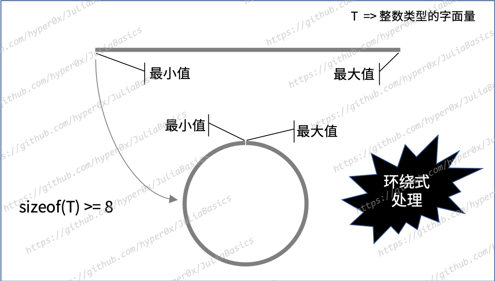
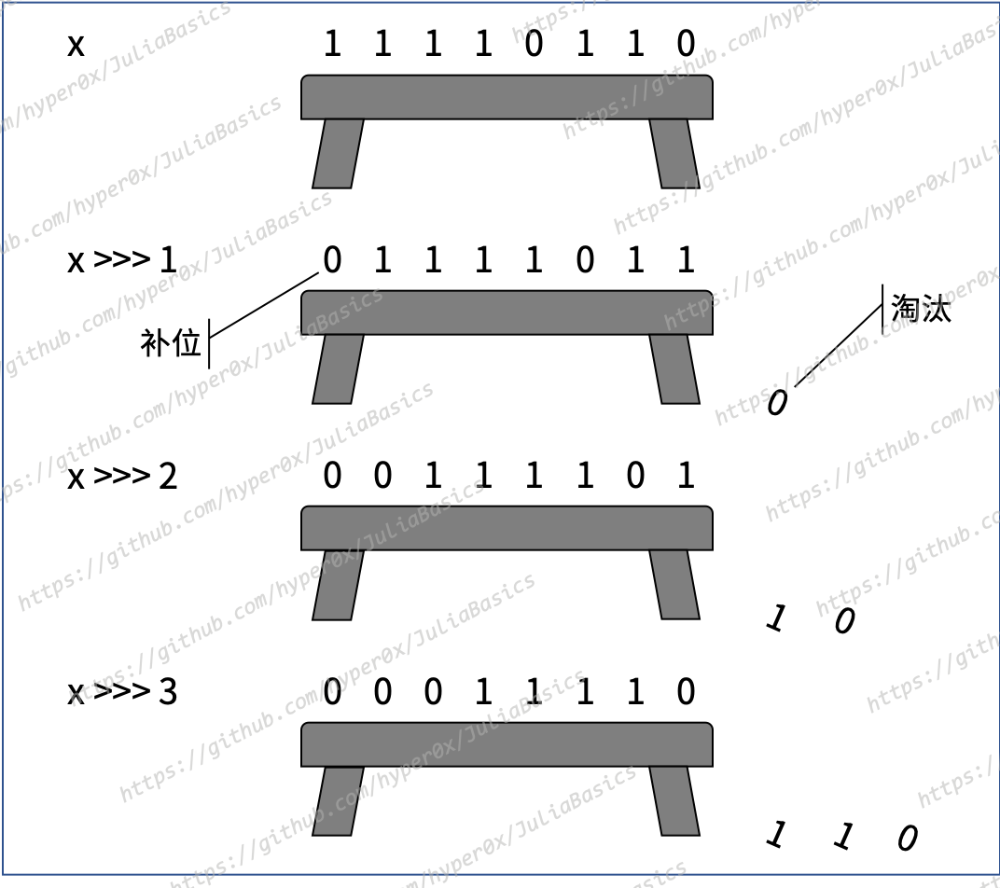

{{TOC}}

# 第 5 章 数值与运算

我们在上一章介绍了 Julia 中的主要类型，其中包括了属于具体类型的原语类型和复合类型。我们用数值类型举了一些例子，还展示了一幅数值类型的层次结构图。这个结构图中的很多类型都是可以被实例化的具体类型。

接下来，我们就从那些具体的数值类型开始，介绍 Julia 编程中最常用的对象。

## 5.1 数值的类型

Julia 中具体的数值类型一共有 19 个。罗列如下。

常用的数值类型：

- 布尔类型：`Bool`
- 有符号整数类型：`BigInt`、`Int8`、`Int16`、`Int32`、`Int64`和`Int128`
- 无符号整数类型：`UInt8`、`UInt16`、`UInt32`、`UInt64`和`UInt128`
- 浮点数类型：`BigFloat`、`Float16`、`Float32`和`Float64`

更多的数值类型：

- 复数类型：`Complex`
- 有理数类型：`Rational`
- 无理数类型：`Irrational`

在那些常用的数值类型中，除了`BigInt`和`BigFloat`之外的其他类型都属于原语类型。而前两个类型以及后面的`Complex`、`Rational`和`Irrational`都属于复合类型。

## 5.2 整数

我们在前面说过，整数类型又被分为有符号类型和无符号类型。后两者分别包含了 6 种和 5 种具体类型。我们为了表示这些类型的值而输入的内容又被称为整数字面量。比如，上一章示例中的`1`、`2`、`4`、`2020`都是整数字面量。

### 5.2.1 类型与取值

整数类型的名称大都很直观，并且它们的宽度也都已经体现在名称中了。详见下表。

_表 5-1 整数类型及其取值_

| 类型名  | 是否有符号？ | 其值占用的比特数 | 最小值 | 最大值    |
| :------ | :----------- | :--------------- | :----- | :-------- |
| Int8    | 是           | 8                | -2^7   | 2^7 - 1   |
| UInt8   | 否           | 8                | 0      | 2^8 - 1   |
| Int16   | 是           | 16               | -2^15  | 2^15 - 1  |
| UInt16  | 否           | 16               | 0      | 2^16 - 1  |
| Int32   | 是           | 32               | -2^31  | 2^31 - 1  |
| UInt32  | 否           | 32               | 0      | 2^32 - 1  |
| Int64   | 是           | 64               | -2^63  | 2^63 - 1  |
| UInt64  | 否           | 64               | 0      | 2^64 - 1  |
| Int128  | 是           | 128              | -2^127 | 2^127 - 1 |
| UInt128 | 否           | 128              | 0      | 2^128 - 1 |

我们最好记住该表中各个类型的最小值和最大值。这并不困难，因为它们是有规律可循的。不过，实在记不住也没有关系。通过调用`typemin`函数和`typemax`函数，我们可以分别获得某一个整数类型能够表示的最小值和最大值，例如：

```julia
julia> typemin(Int8), typemax(Int8)
(-128, 127)

julia> typemin(UInt8), typemax(UInt8)
(0x00, 0xff)

julia> 
```

严格来说，`Bool`类型也属于整数类型。因为它与`Signed`和`Unsigned`一样，也是`Integer`类型的直接子类型。`Bool`类型的宽度（也就是其值占用的比特数）是`8`，最小值是`0`（即`false`），最大值是`1`（即`true`）。

此外，Julia 还定义了`Int`和`UInt`。`Int`代表了有符号整数的默认类型。在 32 位的计算机系统中，它们分别是`Int32`和`UInt32`的别名。而在 64 位的计算机系统中，它们分别是`Int64`和`UInt64`的别名。如此一来，我们在 REPL 环境中随便输入一个整数字面量，就能猜出它的类型：

```julia
julia> typeof(2020) # 在 32 位的计算机系统中 
Int32 

julia> 
```

```
julia> typeof(2020) # 在 64 位的计算机系统中 
Int64

julia> 
```

这完全取决于我们的计算机系统的位数（或者说字宽）。顺便说一句，我们可以通过访问常量`Sys.WORD_SIZE`来获知自己的计算机系统的字宽。

不过，对于较大的整数，Julia 会自动使用宽度更大的整数类型，例如：

```julia
julia> typeof(1234567890123456789)
Int64

julia> typeof(12345678901234567890)
Int128

julia> 
```

注意，在这个例子中，整数字面量的类型是否为`Int128`，依据的不是字面量的长度，而是字面量表示的整数是否大于`Int64`类型的最大值。

### 5.2.2 表示方法

与前面的有符号整数不同，无符号整数会使用以`0x`为前缀的十六进制形式来表示。比如：

```julia
julia> UInt32(2020)
0x000007e4

julia> UInt64(2020)
0x00000000000007e4

julia> 
```

我们都知道，在这些十六进制整数中，字母`a`到`f`分别代表了十进制整数`10`到`15`，并且大写这些字母也是可以的。注意，无符号整数值的类型会由字面量本身决定：

```julia
julia> typeof(0x01)
UInt8

julia> typeof(0x001)
UInt16

julia> typeof(0x00001)
UInt32

julia> typeof(0x000000001)
UInt64

julia> typeof(0x00000000000000001)
UInt128

julia> 
```

无符号整数值`0x01`只需占用 8 个比特（1 位的十六进制数相当于 4 位的二进制数），因此使用`UInt8`类型就足够了。无符号整数值`0x001`占用的比特是 12 个，超出了`UInt8`类型的位数，所以就需要使用`UInt16`类型。而`0x00001`的占位是 20 个，所以需要使用`UInt32`类型。以此类推。总之，一个无符号整数值的默认类型将会是能够容纳它的那个宽度最小的类型。

除了十六进制之外，我们还可以使用二进制或八进制的形式来表示无符号整数值。比如：

```julia
julia> 0b00000001
0x01

julia> 0o001
0x01

julia> 
```

以`0b`为前缀的整数字面量就是以二进制形式表示的整数，而以`0o`为前缀的整数字面量则是以八进制形式表示的整数。在这里，数字`1`至少需要 8 位的二进制数或 3 位的八进制数或 2 位的十六进制数来表示。即使我们输入的位数不够也没有关系，Julia 会自动帮我们在高位补`0`以填满至相应类型的位数（这里是 8 个比特）：

```julia
julia> 0b001
0x01

julia> 0o01
0x01

julia> 0x1
0x01

julia>
```

对于更大的无符号整数值的字面量来说也是类似的。

注意，二进制、八进制和十六进制的字面量可以表示无符号的整数值，但不能表示有符号的整数值。虽然我们可以在这些字面量的前面添加负号`-`，但是它们表示的依然是无符号的整数值。例如：

```julia
julia> -0x01, typeof(-0x01), Int16(-0x01)
(0xff, UInt8, 255)

julia> 
```

不要被字面量`-0x01`中的负号迷惑，它表示的值的类型仍然是`UInt8`。`0xff`实际上是负的`0x01`（也就是`-1`）的补码。但由于十六进制字面量表示的整数值只能是无符号的，所以 Julia 会把它视为一个无符号整数值的原码。如此一来，字面量`-0x01`代表的整数值就是`255`。

顺便说一下，我们可以使用下划线`_`作为数值字面量中的数字分隔符。至于划分的具体间隔，Julia 并没有做硬性的规定。例如：

```julia
julia> 2_020, 0x000_01, 0b000_000_01, -0x0_1
(2020, 0x00000001, 0x01, 0xff)

julia> 
```

### 5.2.3 关于溢出

我们已知每个整数类型的最小值和最大值。当一个整数值超出了其类型的取值范围时，我们就说这个值溢出（overflow）了。

以 64 位的计算机系统为例，Julia 对整数值溢出有两种处理措施，具体如下：

- 对于其类型的宽度小于`64`的整数值，值不变，其类型会被提升到`Int64`。
- 对于其类型的宽度等于或大于`64`的整数值，其类型不变，对值采取环绕式（wraparound）处理。

也就是说，对于`Int8`、`Int16`、`Int32`‌、`UInt8`、`UInt16`和`UInt32`这 6 个类型，Julia 会把溢出值的类型自动地转换为`Int64`。这样的话，这些值就不再是溢出的了。

对于宽度更大的整数类型，Julia 会采取不同的应对措施——环绕式（wraparound）处理。这是什么意思呢？比如，当一个`Int64`类型的整数值比这个类型的最大值还要大`1`的时候，该值就会变成这个类型的最小值。相对应的，当这个类型的整数值比其最小值还要小`1`的时候，该值就会变成这个类型的最大值。示例如下：

```julia
julia> int1 = typemax(Int64)
9223372036854775807

julia> int2 = int1 + 1
-9223372036854775808

julia> int2 == typemin(Int64)
true

julia> int3 = int2 - 1
9223372036854775807

julia> int3 == typemax(Int64)
true

julia> 
```

可以想象一下，对于一个宽度小于`64`的整数类型，它的所有可取值共同形成了一根又长又直的棍子。棍子上的值以由小到大的顺序从左到右排列。棍子的最左端是它的最小值，而最右端是它的最大值。

但对于像`Int64`这样的整数类型来说，其所有可取值共同形成的就不再是一根棍子了，而是一个圆环。这就好像把原来的棍子掰弯并首尾相接了一样。当该类型的值从它的最大值变更为最大值再加`1`时，就好似从圆环接缝的右侧移动一格，到了接缝左侧。相对应的，当该类型的值从它的最小值变更为最小值再减`1`时，就好像从圆环接缝的左侧移动一格，到了接缝右侧。这样的处理方式就叫做对整数溢出的环绕式处理。


_图 5-1 对整数溢出的环绕式处理_

总之，对于`Int64`、`Int128`、`UInt64`和`UInt128`这 4 个类型，Julia 会对溢出值做环绕式处理。

如果你需要的是不会溢出的整数类型，那么可以使用`BigInt`。它的值的大小只受限于当前计算机的内存空间。

### 5.2.4 BigInt

`BigInt`类型属于有符号的整数类型。它表示的数值可以是非常大的正整数，也可以是非常小的负整数。由此，我们可以说，它的值可以是任意精度的。

与其他的整数类型一样，其实例的构造函数与类型拥有相同的名称。并且，我们还可以使用一种非常规的字符串来构造它的值。例如：

```julia
julia> BigInt(1234567890123456789012345678901234567890)
1234567890123456789012345678901234567890

julia> typeof(ans)
BigInt

julia> big"1234567890123456789012345678901234567890"
1234567890123456789012345678901234567890

julia> typeof(ans)
BigInt

julia>
```

可以看到，我们把一串很长的数字传给了`BigInt`函数，并由此构造了一个`BigInt`类型的值。实际上，`BigInt`函数接受的唯一参数可以是任意长度的整数字面量，也可以是任何其他整数类型的值。

甚至，这个构造函数的参数值还可以是像`big"1234"`这样的非常规字符串。不过，我们没有必要这么做。因为`big"1234"`本身就能够表示一个`BigInt`类型的实例。更宽泛地讲，在一个内容形似整数的字符串前添加`big`这 3 个字母就可以把它变成一个`BigInt`类型的值。

另外，任何溢出的整数值的类型都不会被自动地转换成`BigInt`。如有需要，我们只能手动地进行类型转换。

最后，你需要了解的是，虽然`BigInt`直接继承自`Signed`类型，但它是一个比较特殊的整数类型。它被定义在了`Base.GMP`包中，而其他的整数类型的定义都在`Core`包中。GMP 指的是 GNU Multiple Precision Arithmetic Library，可以翻译为多精度算术库。Julia 中的`Base.GMP`包实际上只是对这个库的再次封装而已。虽然如此，这样一个类型的值却可以直接与其他类型的数值一起做数学运算。这主要得益于 Julia 中数值类型的层次结构，以及它的类型提升和转换机制。

## 5.3 浮点数

浮点数可以用来表示小数。在抽象类型`AbstractFloat`之下，有 4 个具体的浮点数类型。它们是`BigFloat`、`Float16`、`Float32`和`Float64`。

我们先说后 3 个类型。

### 5.3.1 精度与换算

这 3 种通常的浮点数类型分别对应着 3 种不同精度的浮点数。详见下表。

_表 5-2 浮点数类型及其取值_

| 类型名  | 精度         | 其值占用的比特数 |
| :------ | :----------- | :--------------- |
| Float16 | 半（half）   | 16               |
| Float32 | 单（single） | 32               |
| Float64 | 双（double） | 64               |

对于这 3 种精度的浮点数，最新的 IEEE 754 技术标准中都有所描述。简单来说，一个浮点数在存储时会由 3 个部分组成，即：正负号部分（sign，简称`S`）、指数部分（exponent，简称`E`）和尾数部分（trailing significand，简称`T`）。例如，一个`Float32`类型的值会占用 32 个比特，其中的正负号会使用 1 个比特，指数部分会使用 8 个比特，而尾数部分会用掉剩下的 23 个比特。

在通常情况下，这 3 个部分会依照下面的公式来共同表示一个浮点数：

> -1^S x 2^E-bias x (1 + 2^1-p x T)

这里的`bias`指的是偏移量，它会是指数部分的比特序列所能表示的最大正整数。注意，指数部分本身也是有符号的。而`p`代表的则是正负号部分和尾数部分共占用的比特数。

下面举一个例子。`Float32`类型的浮点数`-0.75`如果用二进制形式来表示就是这样的：

```julia
julia> bitstring(Float32(-0.75))
"10111111010000000000000000000000"

julia> 
```

在 REPL 环境回显的这个比特串中，最左边的那个`1`就代表了`S`。紧挨在`S`右边的 8 个比特是`01111110`，转换成十进制数就是`126`，这就是`E`。而在`E`右边的 23 个比特则代表`T`，即十进制数`4194304`。另外，对于`Float32`类型来说，`bias`就是`127`，而`p`则是`24`。把这些都代入前面的公式就可以得到：

> -1^1 x 2^-1 x (1 + 0.5) 

最终得出`-0.75`。这就是浮点数与其底层存储之间的换算过程。

对于`Float16`或`Float64`类型的浮点数来说，公式是一样的。只是它们存储那 3 个部分所占用的比特数都会不同。不过，对于一些特殊的浮点数（如正无穷、负无穷等），这个公式就不适用了。至于怎样换算，我们就不在此讨论了。如果你有兴趣，可以去阅读最新的 IEEE 754 技术标准。

上面示例中的函数`bitstring`会把一个数值中的所有比特完全平铺开，并把它们原封不动地塞到一个字符串当中。这样的字符串就叫做比特串。

顺便说一下，如果我们想获取一个浮点数在底层存储上的指数部分，可以调用`exponent`函数。该函数会以返回一个`Int64`类型的值。相关的，`significand`函数用于获取一个浮点数在底层存储上的尾数部分，其结果值的类型是`Float64`。

### 5.3.2 值的表示

我们可以使用数学中的标准形式来写入一个浮点数的字面量，例如：

```julia
julia> -0.75
-0.75

julia> 2.718281828
2.718281828

julia> 
```

如果浮点数的整数部分或小数部分只包含`0`的话，我们还可以把这个`0`省略掉：

```julia
julia> -.5
-0.5

julia> 1.
1.0

julia> 
```

另外，我们还可以使用科学计数法（E-notation）来表示浮点数，如：

```julia
julia> 1e8
1.0e8

julia> 0.5e-6
5.0e-7

julia> 0.25e-2
0.0025

julia> 
```

注意，这里的`e`表示的是以`10`为底的幂运算。紧挨在它右边的那个整数就是指数。因此，`0.25e-2`就相当于`0.25 * 10^-2`。

Julia 的 REPL 环境在必要的时候也会使用科学计数法回显浮点数：

```julia
julia> 0.000025
2.5e-5

julia> 2500000.0
2.5e6

julia> 
```

对于我们在上面写入的这些浮点数，Julia 都会把它们识别为`Float64`类型的值。如果你想把一个浮点数转换为`Float32`类型的，那么有两种方式。一种方式是，使用该类型对应的构造函数。另一种方式是，把科学计数法中的`e`改为`f`。比如：

```julia
julia> Float32(0.000025)
2.5f-5

julia> typeof(2.5f-5)
Float32

julia> 
```

注意，这里的`f`表示的同样是以`10`为底的幂运算。只不过由它参与生成的浮点数一定是`Float32`类型的。

对于`Float16`类型的浮点数来说，我们使用科学计数法表示的时候会有些特殊。它由 3 个部分组成，即：一个用十六进制形式表示的整数、一个代表了以`2`为底的幂运算的字母`p`，以及一个代表指数的整数。示例如下：

```julia
julia> 0x1p0
1.0

julia> 0x1p1
2.0

julia> 0x1p3
8.0

julia> 0x1p-2
0.25

julia> 
```

可以看到，在我们改动代表指数的那个整数时，浮点数是以`2`或`0.5`的倍数来改变的。显然，使用这种方式表示的浮点数在精度上会比较低。这主要是由于在`p`左边的只能是整数。

`Float16`的这种特殊性不仅在于表示形式。它的底层实现也是比较特殊的。由于在传统的计算机硬件中并没有半精度浮点数这一概念，所以这种浮点数可能无法在硬件层面直接参与运算。Julia 只能采用软实现的方式来支持`Float16`，并且在运算的时候把这类值的类型转换成`Float32`。

### 5.3.3 特殊的浮点数

特殊的浮点数包括正零、负零、正无穷、负无穷，以及 NaN。

正零（positive zero）和负零（negative zero）虽然在数学逻辑上是相同的，但是在底层存储上却是不同的。请看下面的代码：

```julia
julia> 0.0 == -0.0 
true

julia> bitstring(0.0)
"0000000000000000000000000000000000000000000000000000000000000000"

julia> bitstring(-0.0)
"1000000000000000000000000000000000000000000000000000000000000000"

julia> 
```

在默认情况下，`0.0`和`-0.0`都是`Float64`类型的值，但在这里并不重要。重要的是，在存储时，它们的指数部分和尾数部分都是`0`。这是 IEEE 754 技术标准中针对这两个浮点数的特殊二进制表示法。在这种情况下，如果正负号部分是`0`，那么它就代表`0.0`，否则就代表`-0.0`。

与正零和负零相比，正无穷（positive infinity）、负无穷（negative infinity）和 NaN（Not a Number） 就更加特殊了。并且，它们对应于不同的浮点数类型都有着不同的标识符。请看下面这张表。

_表 5-3 非常特殊的 3 种浮点数_

| Float16 | Float32 | Float64 | 含义                                   | 说明                               |
| :------ | :------ | :------ | :------------------------------------- | :--------------------------------- |
| Inf16   | Inf32   | Inf     | 正无穷（positive infinity），统称 Inf  | 大于所有有限浮点数的值             |
| -Inf16  | -Inf32  | -Inf    | 负无穷（negative infinity），统称 -Inf | 小于所有有限浮点数的值             |
| NaN16   | NaN32   | NaN     | 非数（not a number），统称 NaN         | 不等于任何浮点数（包括它本身）的值 |

Julia 为这 3 种非常特殊的浮点数一共定义了 9 个常量。它们的名称分别在此表格最左侧的 9 个单元格中。由于浮点数字面量默认都是`Float64`类型的，所以这些常量的名称也是以`Float64`下的名称为基准的。

`Inf16`、`Inf32`和`Inf`代表的都是正无穷。它们一定都大于所有的有限浮点数。因此，我们像下面这样调用`typemax`函数就可以得到对应类型的正无穷：

```julia
julia> typemax(Float16), typemax(Float32), typemax(Float64)
(Inf16, Inf32, Inf)

julia> 
```

相对应的，`-Inf16`、`-Inf32`和`-Inf`都代表负无穷。它们一定都小于所有的有限浮点数。所以：

```julia
julia> typemin(Float16), typemin(Float32), typemin(Float64)
(-Inf16, -Inf32, -Inf)

julia> 
```

而`NaN16`、`NaN32`和`NaN`的含义都是非数（或者说不是数）。因此，一些无效操作的结果值以及无法确切定义的浮点数就都归于它们的名下了。比如：

```julia
julia> 0 / 0
NaN

julia> Inf - Inf
NaN

julia> Inf16 - Inf16
NaN16

julia> -Inf - -Inf
NaN

julia> Inf / Inf
NaN

julia> Inf32 / Inf32
NaN32

julia> -Inf / Inf
NaN

julia> 0 * Inf
NaN

julia> 
```

这些运算规则都遵循了 IEEE 754 技术标准中的描述。所以我们也不用专门记忆。等到真正需要的时候再去查阅相关文档就好了。

### 5.3.4 BigFloat

`BigFloat`是`Base.MPFR`包中定义的一个类型。MPFR 本身是一个具有正确舍入（rounding）功能的用于多精度浮点计算（multiple-precision floating-point computations）的 C 语言程序库。而`Base.MPFR`包只是对这个库再次封装。

`BigFloat`类型代表着任意精度的浮点数。示例如下：

```julia
julia> BigFloat(-0.75^68) / 3
-1.064252443341024990056571709262760635124796711655411248405774434407552083333339e-09

julia> typeof(ans)
BigFloat

julia> 
```

与`BigInt`一样，我们使用以`big`为前缀的非常规字符串也可以构造出`BigFloat`的值，比如：

```julia
julia> big"-0.75"
-0.75

julia> typeof(ans)
BigFloat

julia> big"2.718281828"
2.718281828000000000000000000000000000000000000000000000000000000000000000000015

julia> typeof(ans)
BigFloat

julia> 
```

另外，我们都知道，通常的浮点数类型都有着固定的精度。而且，在默认情况下，Julia 对浮点数的舍入模式是四舍五入（由于计算机无法精确地表示所有小数，而且浮点数的位数有限，所以舍入必然存在，舍入模式也是必须要有的）。然而，对于`BigFloat`类型，我们可以自己设定它的精度和舍入模式。

通过调用`setprecision`和`setround`函数，我们可以更改`BigFloat`类型值在参与运算时的默认精度和舍入模式。但要注意，这种更改是全局的！也就是说，更改一旦发生，它就会影响到当前 Julia 程序中所有相关的后续操作。不过，我们可以利用`do`代码块，让这种更改只在当前的代码块中有效。下面是一些示例：

```julia
julia> BigFloat(1.01) + parse(BigFloat, "0.2")
1.210000000000000008881784197001252323389053344726562500000000000000000000000007

julia> setrounding(BigFloat, RoundDown)
MPFRRoundDown::MPFRRoundingMode = 3

julia> BigFloat(1.01) + parse(BigFloat, "0.2")
1.21000000000000000888178419700125232338905334472656249999999999999999999999999

julia> setprecision(35) do 
           BigFloat(1.01) + parse(BigFloat, "0.2") 
       end
1.2099999999

julia> BigFloat(1.01) + parse(BigFloat, "0.2") 
1.21000000000000000888178419700125232338905334472656249999999999999999999999999

julia> 
```

示例中的函数`parse`可以帮助我们把一个字符串值转换成某个数值类型的值。不过，转换是否能够成功就要看字符串的具体内容了。如果不能成功转换，这个函数就会报错。

至于都有哪些舍入模式，我们可以参看`Base.Rounding.RoundingMode`类型的文档。我们在前面说的默认舍入模式是由常量`Base.Rounding.RoundNearest`代表的。另外，我们在后面讲流程控制的时候还会对`do`代码块进行说明。

## 5.4 复数和有理数

### 5.4.1 复数

Julia 预定义的复数类型是`Complex`。它是`Number`的直接子类型。为了构造出复数的虚部，Julia 还专门定义了一个常量`im`。这里的 im 是 imaginary 的缩写。它使用起来是这样的：

```julia
julia> 1 + 2im; typeof(1+2im)
Complex{Int64}

julia> 1.1 + 2.2im; typeof(1.1+2.2im)
Complex{Float64}

julia> 
```

可以看到，`Complex`是一个参数化的类型。因为在其名称的右侧还有一个由花括号包裹的类型参数。这个类型参数会是一个代表了某个类型的标识符。关于参数化类型，我们在下下一章就会讲到。

为了使常见的数学公式和表达式更加清晰，Julia 允许在变量之前紧挨一个数值字面量，以表示两个数相乘。比如，如果变量`x`的值是整数`8`，那么`2x^3`就表示`2`乘以`8`的`3`次方。又比如，`2^3x`表示`2`的`24`次方。在这种情况下，变量`x`就被称为数值字面量系数（numeric literal coefficient）。

正因为如此，我们才需要特别注意，上例中的`2im`和`2.2im`虽然看起来与这种表示法非常相似，但其含义却是完全不同的。整数或浮点数的字面量与常量`im`共同组成的是一个复数的虚部。而且还要注意，在构造复数的虚部时，我们就不能再使用数值字面量系数了。因为这肯定会产生歧义。比如，`1 + 2xim`就是不合法的，除非已经存在一个名为`xim`的变量，但如此一来这表示的就不是一个复数了。如果必须有变量参与复数的构造，那么我们可以使用`complex`函数，例如：`complex(1, 2x)`。

Julia 允许复数参与标准的数学运算。所以，下面的这些数学表达式是合法的：

```julia
julia> (1 + 2im) + (3 + 4im)
4 + 6im

julia> (1 + 2im) - (3 + 4im)
-2 - 2im

julia> (1 + 2im) * (3 + 4im)
-5 + 10im

julia> (1 + 2im) / (3 + 4im)
0.44 + 0.08im

julia> 3(1 + 2im)^8
-1581 + 1008im

julia> 
```

例子中的圆括号代表着对运算次序的设定。这与它在数学中的一般含义是一致的。

要想分别得到一个复数的实部和虚部，我们就需要调用`real`函数和`imag`函数。示例如下：

```julia
julia> com1 = 1 + 2im 
1 + 2im

julia> real(com1), imag(com1)
(1, 2)

julia> 
```

另外，我们还可以利用`conj`函数求出一个复数的共轭（conjugate），以及使用`abs`函数计算出一个复数与`0`之间的距离，等等。总之，Julia 预定义的很多数学函数都可以应用于复数。

### 5.4.2 有理数

我们在前面说过，浮点数无法精确地表示所有小数。比如，`1/3`是一个无限循环小数，但用浮点数表示的话只能是这样的：

```julia
julia> 1/3
0.3333333333333333

julia> typeof(ans)
Float64

julia> 
```

严格来说，`1/3`并不是一个浮点数。因为浮点数会对无限循环小数做舍入，这会损失精度。但是，它肯定是一个有理数。

在 Julia 中，有理数用于表示两个整数之间的精确比率。有理数的类型是`Rational`。它的值可以由操作符`//`来构造。代码如下：

```julia
julia> 1//3
1//3

julia> typeof(ans)
Rational{Int64}

julia> 
```

在操作符`//`左侧的被称为分子，而在它右侧的被称为分母。注意，这两个数都只能是整数，而不能是浮点数。

如果在分子和分母之间存在公因数，那么 Julia 会自动地把它们化为最小项并让分母变为非负整数。例如：

```julia
julia> 3//9
1//3

julia> 3//-9
-1//3

julia> 42//126
1//3

julia> 
```

函数`numerator`和`denominator`可以让我们分别得到一个有理数的分子和分母：

```julia
julia> rat1 = 1//3
1//3

julia> numerator(rat1)
1

julia> denominator(rat1)
3

julia>  
```

有理数可以参与标准的数学运算。比如，我们可以拿一个有理数与一个整数、浮点数或者其他有理数进行比较。又比如，我们可以对有理数进行加减乘数等运算。另外，有理数也可以很容易地被转换为浮点数。例如：

```julia
julia> float(1//3) 
0.3333333333333333

julia> 
```

我在前面也说了，这实际上会存在精度上的损失。

最后，需要我们注意的是，`0//0`是不合法的。该字面量会引发一个错误。相应的，表示浮点数的字面量`0/0`等同于`NaN`。从技术标准的角度讲，`NaN`不与任何东西（包括它自己）相等。

## 5.5 常用的数学运算

Julia 中的一些操作符可以用于数学运算或位运算（也就是比特运算）。这样的操作符也可以被称为运算符。因此，我们就有了数学运算符和位运算符这两种说法。

### 5.5.1 数学运算符

可用于数学运算的运算符请见下表。

_表 5-4 数学运算符_

| 运算名称 | 运算符 | 示意表达式 | 用途                        |
| :------- | :----- | :--------- | :-------------------------- |
| 一元加   | +      | +x         | 求 x 的原值                 |
| 一元减   | -      | -x         | 求 x 的相反数，相当于 0 - x |
| 平方根   | √      | √x         | 求 x 的平方根               |
| 二元加   | +      | x + y      | 求 x 和 y 的和              |
| 二元减   | -      | x - y      | 求 x 与 y 的差              |
| 乘       | *      | x * y      | 求 x 和 y 的积              |
| 除       | /      | x / y      | 求 x 与 y 的商              |
| 逆向除   | \      | x \ y      | 相当于 y / x                |
| 整除     | ÷      | x ÷ y      | 求 x 与 y 的商且只保留整数  |
| 求余运算 | %      | x % y      | 求 x 除以 y 后得到的余数    |
| 幂运算   | ^      | x ^ y      | 求 x 的 y 次方              |

可以看到，Julia 中通用的数学运算符共有 9 个。其中，与`+`和`-`一样，`√`也是一个一元运算符。它的含义是求平方根。在 REPL 环境中，我们可以通过输入`\sqrt[Tab]`写出这个符号。我们还可以用函数调用`sqrt(x)`来替代表达式`√x`。

所谓的一元运算是指，只有一个数值参与的运算，比如`√x`。更宽泛地讲，根据参与操作的对象的数量，操作符可被划分为一元操作符（unary operator）、二元操作符（binary operator）或三元操作符（ternary operator）。其中，参与操作的对象又被称为操作数（operand）。

除上述的运算符之外，Julia 还有一个专用于`Bool`类型值的一元运算符`!`，称为求反运算符。它会将`true`变为`false`，反之亦然。

这些数学运算符都是完全符合数学逻辑的。所以我在这里就不再展示它们的示例了。

### 5.5.2 位运算符

我们都知道，任何值在底层都是根据某种规则以二进制的形式存储的。数值也不例外。我们把以二进制形式表示的数值简称为二进制数。所谓的位运算，就是针对二进制数中的比特（或者说位）进行的运算。这种运算可以逐个地控制数中每个比特的具体状态（`0`或`1`）。

Julia 中的位运算符共有 7 个。如下表所示。

_表 5-5 位运算符_

| 运算名称 | 运算符 | 示意表达式 | 简要说明                                                             |
| :------- | :----- | :--------- | :------------------------------------------------------------------- |
| 按位求反 | ~      | ~x         | 求 x 的反码，相当于每一个二进制位都变反                              |
| 按位求与 | &      | x & y      | 逐个对比 x 和 y 的每一个二进制位，只要有`0`就为`0`，否则为`1`        |
| 按位求或 | `|`    | `x | y`    | 逐个对比 x 和 y 的每一个二进制位，只要有`1`就为`1`，否则为`0`        |
| 按位异或 | ⊻      | x ⊻ y      | 逐个对比 x 和 y 的每一个二进制位，只要不同就为`1`，否则为`0`         |
| 逻辑右移 | >>>    | x >>> y    | 把 x 中的所有二进制位统一向右移动 y 次，并在空出的位上补`0`          |
| 算术右移 | >>     | x >> y     | 把 x 中的所有二进制位统一向右移动 y 次，并在空出的位上补原值的最高位 |
| 逻辑左移 | <<     | x << y     | 把 x 中的所有二进制位统一向左移动 y 次，并在空出的位上补`0`          |

利用`bitstring`函数，我们可以很直观地见到这些位运算符的作用。例如：

```julia
julia> x = Int8(-10)
-10

julia> bitstring(x)
"11110110"

julia> bitstring(~x)
"00001001"

julia> 
```

可以看到，按位求反的运算符`~`会把`x`中的每一个比特的状态都变反（由`0`变成`1`或由`1`变成`0`）。这也是 Julia 中唯一的一个只需一个操作数的位运算符。因此，它与前面的`+`和`-`一样，都可以被称为一元运算符。

我们再来看按位求与和按位求或：

```julia
julia> y = Int8(17)
17

julia> bitstring(x)
"11110110"

julia> bitstring(y)
"00010001"

julia> bitstring(x & y)
"00010000"

julia> bitstring(x | y)
"11110111"

julia>
```

我们定义变量`y`，并由它来代表`Int8`类型的整数`17`。`y`的二进制表示是`00010001`。对比变量`x`的二进制表示`11110110`，它们只在左数第 4 位上都为`1`。因此，`x & y`的结果就是`00010000`。另一方面，它们只在右数第 4 位上都为`0`，所以`x | y`的结果就是`11110111`。

按位异或的运算符`⊻`看起来很特别。因为在别的编程语言中没有这个操作符。在 REPL 环境中，我们可以通过输入`\xor[Tab]`或`\veebar[Tab]`写出这个符号。我们还可以用函数调用`xor(x, y)`来替代表达式`x ⊻ y`。

我们在前表中也说明了，`x ⊻ y`的含义就是逐个对比`x`和`y`的每一个二进制位，只要不同就为`1`，否则为`0`。示例如下：

```julia
julia> bitstring(x), bitstring(y), bitstring(x ⊻ y)
("11110110", "00010001", "11100111")

julia> 
```

Julia 提供了 3 种位移运算，分别是逻辑右移、算术右移和逻辑左移。下面是演示代码：

```julia
julia> bitstring(x)
"11110110"

julia> bitstring(x >>> 3)
"00011110"

julia> bitstring(x >> 3)
"11111110"

julia> bitstring(x << 3)
"10110000"

julia>
```

在位移运算的过程中，数值的宽度（或者说占用的比特数）是不变的。我们可以把承载一个数值的存储空间看成一条板凳，而数值的宽度就是这条板凳的宽度。现在，有一条板凳承载了`x`变量代表的那个整数，并且宽度是`8`。也就是说，这条板凳上有 8 个位置，可以坐 8 个比特（假设比特是某种生物）。

每一次位移，板凳上的 8 个比特都会作为整体向左或向右移动一个位置。在移动完成后，总会有 1 个比特被挤出板凳而没有位置可坐，并且也总会有 1 个位置空出来。比如，如果向右位移一次，那么最右边的那个比特就会被挤出板凳，同时最左边会空出一个位置。没有位置可坐的比特会被淘汰，而空出来的位置还必须引进 1 个新的比特。

好了，我们现在来看从`11110110`到`00011110`的运算过程。后者是前者逻辑右移三次之后的结果。按照前面的描述，在向右移动三次之后，最右边的 3 个比特被淘汰了。因此，这时的二进制数就变为了`11110`。又由于，逻辑右移运算会为所有的空位都填补`0`（状态为`0`的比特），所以最终的二进制数就是`00011110`。


_图 5-2 逻辑右移的示意_

与逻辑右移相比，算术右移只有一点不同，那就是：它在空位上填补的不是`0`，而是原值的最高位。什么叫最高位？其实它指代的就是位置最高的那个比特。对于一个二进制数，最左边的那个位置就是最高位，而最右边的那个位置就是最低位。`x`的值`11110110`的最高位是`1`。因此，在算术右移三次之后，我们得到的新值就是`11111110`。

与右移运算不同，左移运算只有一种。我们把它称为逻辑左移。这主要是因为该运算也会为空位填补`0`。所以，`11110110`经过逻辑左移三次之后就得到了`10110000`。

### 5.5.3 运算同时赋值

Julia 中的每一个二元的数学运算符和位运算符都可以与赋值符号`=`联用，可称之为更新运算符。联用的含义是把运算的结果再赋给参与运算的变量。例如：

```julia
julia> x = 10; x %= 3
1

julia>
```

REPL 环境回显的`1`就是变量`x`的新值。但要注意，这种更新运算相当于把新的值与原有的变量进行绑定，所以原有变量的类型可能会因此发生改变。示例如下：

```julia
julia> x = 10; x /= 3
3.3333333333333335

julia> typeof(x)
Float64

julia> 
```

显然，`x`变量原有的类型肯定是某个整数类型（`Int64`或`Int32`）。但更新运算使它的值变成了一个`Float64`类型的浮点数。因此，该变量的类型也随之变为了`Float64`。

所有的更新运算符罗列如下：

```julia
+= -= *= /= \= ÷= %= ^= &= |= ⊻= >>>= >>= <<=
```

前 8 个属于数学运算，后 6 个属于位运算。

### 5.5.4 数值的比较

理所应当，数值与数值之间是可以比较的。在 Julia 中，这种比较不但可以发生在同类型的值之间，还可以发生在不同类型的值之间，比如整数和浮点数。通常，比较的结果会是一个`Bool`类型的值。

对于整数之间的比较，我们就不多说了。它与数学中的标准定义没有什么两样。至于浮点数，相关操作仍然会遵循 IEEE 754 技术标准。这里存在 4 种互斥的比较关系，即：小于（less than）、等于（equal）、大于（greater than）和无序的（unordered）。

具体的浮点数比较规则如下：

+ 只要参与比较的两个数值中有一个是 NaN，比较的结果就必然是`false`。因为 NaN 不与任何东西相等，包括它自己。或者说，这种情况下的所有比较关系都是无序的。
+ Inf 等于它自己，并且一定大于除了 NaN 之外的任何数。
+ -Inf 等于它自己，并且一定小于除了 NaN 之外的任何数。
+ 正零（0.0）和负零（-0.0）是相等的。尽管它们在底层存储上是不同的。
+ 其他情况下的有限浮点数比较将会按照数学中的标准定义进行。

Julia 中标准的比较操作符如下表。

_表 5-6 比较操作符_

| 操作符 | 含义       |
| :----- | :--------- |
| ==     | 等于       |
| != ≠   | 不等于     |
| <      | 小于       |
| <= ≤   | 小于或等于 |
| >      | 大于       |
| >= ≥   | 大于或等于 |

注意，对于不等于、小于或等于以及大于或等于，它们都有两个等价的操作符可用。表中已用空格将它们分隔开了。

这些比较操作符都可以用于链式比较，例如：

```julia
julia> 1 < 3 < 5 > 2
true

julia> 
```

只有当链式比较中的各个二元比较的结果都为`true`时，链式比较的结果才会是`true`。注意，我们不要揣测链中的比较顺序，因为 Julia 未对此做出任何定义。

在这些比较操作符当中，我们需要重点关注一下`==`。我们之前使用过一个用于判断相等的操作符`===`。另外，还有一个名叫`isequal`的函数也可以用于判等。我们需要明确这三者之间的联系和区别。

首先，操作符`===`代表最深入的判等操作。我们在前面说过，对于可变的值，这个操作符会比较它们在内存中的存储地址。而对于不可变的值，该操作符会逐个比特地比较它们。

其次是操作符`==`。它完全符合数学中的判等定义。它只会比较数值本身，而不会在意数值的类型和底层存储方式。对于浮点数，这种判等操作会严格遵循 IEEE 754 技术标准。顺便说一句，在判断两个字符串是否相等时，它会逐个字符地进行比较，而忽略其底层编码。

函数`isequal`用于更加浅表的判等。在大多数情况下，它的行为都会依从于操作符`==`。在不涉及浮点数的时候，它会直接返回`==`的判断结果。那为什么说它更加浅表呢？这是因为，对于那些特殊的浮点数值，它只会去比较它们的字面含义。它同样会判断两个 Inf（或者两个 -Inf）是相等的，但也会判断两个 NaN 是相等的，还会判断`0.0`和`-0.0`是不相等的。这些显然并未完全遵从 IEEE 754 技术标准中的规定。下面是相应的示例：

```julia
julia> isequal(NaN, NaN)
true

julia> isequal(NaN, NaN16)
true

julia> isequal(Inf32, Inf16)
true

julia> isequal(-Inf, -Inf32)
true

julia> isequal(0.0, -0.0)
false

julia> 
```

另外，`===`和`isequal`无论如何都会返回一个`Bool`类型的值作为结果。操作符`==`在绝大多数情况下也会如此。但当至少有一方的值是`missing`时，它就会返回`missing`。`missing`是一个常量，也是类型`Missing`的唯一实例。它用于表示当前值是缺失的。

下面的代码展示了上述 3 种判等操作在涉及`missing`时的判断结果：

```julia
julia> missing === missing
true

julia> missing === 0.0
false

julia> missing == missing
missing

julia> missing == 0.0
missing

julia> isequal(missing, missing)
true

julia> isequal(missing, 0.0)
false

julia> 
```

最后，对于不同类型数值之间的比较，Julia 一般会贴合数学上的定义。比如：

```julia
julia> 0 == 0.0
true

julia> 1/3 == 1//3
false

julia> 1 == 1+0im
true

julia> 
```

### 5.5.5 操作符的优先级

Julia 对各种操作符都设定了特定的优先级。另外，Julia 还规定了它们的结合性。操作符的优先级越高，它涉及的操作就会越提前进行。比如：对于运算表达式`10 + 3^2`来说，由于运算符`^`的优先级比作为二元运算符的`+`更高，所以幂运算`3^2`会先进行，然后才是求和运算。

操作符的结合性主要用于解决这样的问题：当一个表达式中存在且仅存在多个优先级相同的操作符时，操作的顺序应该是怎样的。一个操作符的结合性可能是，从左到右的、从右到左的或者未定义的。像我们在前面说的比较操作符的结合性就是未定义的。

下表展示了本章所述运算符的优先级和结合性。上方运算符的优先级会高于下方的运算符。

_表 5-7 运算符的优先级和结合性_

| 操作符                                            | 用途                               | 结合性     |
| :------------------------------------------------ | :--------------------------------- | :--------- |
| + - √ ~ ^                                         | 一元的数学运算和位运算，以及幂运算 | 从右到左的 |
| << >> >>>                                         | 位移运算                           | 从左到右的 |
| `* / \ ÷ % &`                                     | 乘法、除法和按位与                 | 从左到右的 |
| `+ - | ⊻`                                         | 加法、减法、按位或和按位异或       | 从左到右的 |
| == != < <= > >= === !==                           | 比较操作                           | 未定义的   |
| `= += -= *= /= \= ÷= %= ^= &= |= ⊻= >>>= >>= <<=` | 赋值操作和更新运算                 | 从右到左的 |

此外，数值字面量系数（如`-3x+1`中的`x`）的优先级略低于那几个一元运算符。因此，表达式`-3x`会被解析为`(-3) * x`，而表达式`√4x`则会被解析为`(√4) * x`。可是，它与幂运算符的优先级却是相当的。所以，表达式`3^2x`和`2x^3`会被分别解析为`3^(2x)`和`2 * (x^3)`。也就是说，它们之间会依照从右到左的顺序来结合。

对于运算表达式，我们理应更加注重正确性和（人类）可读性。因此，我们总是应该在复杂的表达式中使用圆括号来明确运算的顺序。比如，表达式`(2x)^3`的运算顺序就一定是先做乘法运算再做幂运算。不过，过多的括号有时也会降低可读性。所以我们往往需要对此做出权衡。如有必要，我们可以分别定义表达式的各个部分，然后再把它们组合在一起。

## 5.6 数值类型的提升

Julia 中有一个辅助系统，叫做类型提升系统。它可以将数学运算符操作的多个值统一地转换为某个公共类型的值，以便运算的顺利进行。我们下面就简要地说明一下这个辅助系统的应用和作用。关于公共类型的解释也会在其中。

在 Julia 中，数学运算符其实也是用函数实现的。就拿用于二元加的运算符`+`来说，它的一个衍生方法的定义是这样的：

```julia
+(x::Float64, y::Float64) = add_float(x, y)
```

这个定义向我们揭示了两个细节。第一个细节就是我刚刚说的，数学运算符是由函数实现的。不仅如此，针对每一类可操作的数值，Julia 都定义了相应的衍生方法。第二个细节是，数学运算符操作的多个值必须是同一个类型的。你可能会有疑问，那为什么我们编写的像`1 + 2.0`这样的运算依然可以顺利进行呢？实际上，这恰恰得益于 Julia 的类型提升系统。我们来看该系统中的一个定义：

```julia
+(x::Number, y::Number) = +(promote(x,y)...)
```

这个衍生方法的两个参数的类型都是`Number`。这就意味着，只要参与二元加的操作数都是数值且它们的类型不同，该运算就会被分派到这个方法上。如果两个数值的类型相同，那么二元加运算就会被分派到像前一个定义那样的方法上。

请注意，这个衍生方法的定义中有一个对`promote`函数的调用。这个函数其实就代表了类型提升系统的核心算法。我们可以在 REPL 环境中输入表达式`promote(1, 2.0)`并回车。其结果如下：

```julia
julia> promote(1, 2.0)
(1.0, 2.0)

julia> typeof(ans)
Tuple{Float64,Float64}

julia> 
```

我们都知道，在 64 位的计算机系统中，字面量`1`的类型一定是`Int64`，而字面量`2.0`的类型肯定是`Float64`。由此，在那个调用`promote`函数后得到的元组中，包含了转换自参数值`1`的、`Float64`类型的数值`1.0`，以及保持原样的、`Float64`类型的数值`2.0`。这正是类型提升系统所起到的作用。它一般会先找到能够无损地表示输入值的某个公共类型，然后把这些值都转换为此公共类型的值（通常通过调用`convert`函数实现），最后输出这些类型统一的值。

在一般情况下，如果参数值列表中只包含了整数和有理数，那么`promote`函数就会把这些参数值都转换为有理数。倘若参数值列表中存在浮点数（但不存在复数），那么这个函数就会把这些参数值都转换为适当类型的浮点数。一旦参数值列表中有复数，那该函数就一定会返回适当类型的复数的元组。另一方面，如果这些参数值的类型只是在宽度上所有不同（如`Int64`和`Int8`、`Float16`和`Float32`等等），那么`promote`函数就会把它们都转换为宽度较大的那个类型的值。

我们倒是不用死记硬背这些规则。因为有一个名叫`promote_type`的函数，它可以接受若干个类型字面量并返回它们的公共类型。例如：

```julia
julia> promote_type(Int64, Float64)
Float64

julia> promote_type(Int64, Int8)
Int64

julia> promote_type(Float16, Float32)
Float32

julia> 
```

请注意，我们一直在说的是多个类型的公共类型，而不是多个类型的共同超类型。这两者之间并没有任何关联。如果你确实想得到两个类型的共同超类型，那么可以调用`typejoin`函数。例如，调用表达式`typejoin(Int, Float64)`的求值结果会是`Real`。

好了，不论细节如何，经过前文所述的处理之后，这些数值就可以交给普通的运算符实现方法进行操作了。就像这样：

```julia
julia> +(promote(1, 2.0)...)
3.0

julia> 
```

这里对`+`函数的调用会被分派到我们在前面展示的那个针对`Float64`类型的衍生方法上。

解释一下，符号`...`的作用是，把紧挨在它左边的那个值中的所有元素值（如元组`(1.0, 2.0)`中的`1.0`和`2.0`）都平铺开来，并让这些元素值都成为传入外层函数（如`+`函数）的独立参数值。所以，调用表达式`+((1.0, 2.0)...)`就相当于`+(1.0, 2.0)`。

至于什么是元组，你现在可以简单地把它理解为由圆括号包裹的、可承载若干值的容器。函数在同时返回多个值的时候通常就会用这种数据结构呈现。在后面讲参数化类型的那一章里有对元组的详细说明。

除了以上讲的这些，Julia 的类型提升系统还有一个很重要的作用，那就是：让我们可以编写自己的类型提升规则，以自定义数学运算的部分行为，尤其是在操作数的类型不同的时候。例如，若我们想让整数和浮点数的运算结果变成`BigFloat`类型的值，则可以这样做：

```julia
julia> import Base.promote_rule

julia> promote_rule(::Type{Int64}, ::Type{Float64}) = BigFloat
promote_rule (generic function with 137 methods)

julia>
```

第一行代码是一条导入语句。简单来说，我们在编写某个函数的衍生方法的时候必须先导入这个函数。第二行代码就是我编写的衍生方法。由于与之相关的一些背景知识我们还没有讲到，所以你看不太懂也没有关系。在这里，你只要关注这行代码中的`Int64`、`Float64`和`BigFloat`就可以了。前两个都代表了操作数的类型，而后一个则代表了它们的公共类型。这正是在定义操作数类型和公共类型的对应关系。

现在，我们再次执行之前的代码：

```julia
julia> promote(1, 2.0)
(1.0, 2.0)

julia> typeof(ans)
Tuple{BigFloat,BigFloat}

julia> 
```

可以看到，这次调用`promote`函数后得到的元组包含了两个`BigFloat`类型的值。这就说明我们刚刚编写的类型提升规则已经生效了。当然，修改 Julia 内置的类型提升规则是比较危险的。因为这可能会改变已有代码的基本行为，并且会明显地降低程序的稳定性，所以还是要谨慎为之。但对于我们自己搭建的数值类型体系来讲，这一特性的潜力是非常可观的。

总之，Julia 的类型提升系统辅助维护着数学运算的具体实现。其中有着大量的默认规则，并确保着常规运算的有效性。但同时，它也允许我们自定义类型提升的规则，以满足自己的特殊需要。

## 5.7 数学函数速览

Julia 预定义了非常丰富的数学函数。一些常用的函数如下：

- **数值类型转换：** 主要有`T(x)`和`convert(T, x)`。其中，`T`代表目的类型，`x`代表源值。
- **数值特殊性判断：** 有`isequal`、`isfinite`、`isinf`和`isnan`。
- **舍入：** 有四舍五入的`round(T, x)`、向正无穷舍入的`ceil(T, x)`、向负无穷舍入的`floor(T, x)`，以及总是向`0`舍入的`trunc(T, x)`。
- **除法：** 有`cld(x, y)`、`fld(x, y)`和`div(x, y)`，它们分别会将商向正无穷、负无穷和`0`做舍入。其中的`x`代表被除数，`y`代表除数。另外，与之相关的还有取余函数`rem(x, y)`和取模函数`mod(x, y)`，等等。
- **公约数与公倍数：** 函数`gcd(x, y...)`用于求取最大正公约数，而函数`lcm(x, y...)`则用于求取最小正公倍数。圆括号中的`...`的意思是，除了`x`和`y`，函数还允许传入更多的数值。但要注意，这里的数值都应该是整数。
- **符号获取：** 函数`sign(x)`和`signbit(x)`都用于获取一个数值的符号。但不同的是，前者对于正整数、`0`和负整数会分别返回`1`、`0`和`-1`，而后者会分别返回`false`、`false`和`true`。
- **绝对值获取：** 用于获取绝对值的函数是`abs(x)`。一个相关的函数是，用于求平方的`abs2(x)`。
- **求根：** 函数`sqrt(x)`用于求取`x`的平方根，而函数`cbrt(x)`则用于求取`x`的立方根。
- **求指数：** 函数`exp(x)`会求取`x`的自然指数。另外还有`expm1(x)`，为接近`0`的`x`计算`exp(x)-1`。
- **求对数：** `log(x)`会求取`x`的自然对数，`log(b, x)`会求以`b`为底的`x`的对数，而`log2(x)`和`log10(x)`则会分别以`2`和`10`为底求对数。另外还有`log1p(x)`，为接近`0`的`x`计算`log(1+x)`。

除了以上函数之外，Julia 的`Base`包中还定义了很多三角函数和双曲函数，比如`sin`、`cos`、`atanh`、`acoth`等等。另外，在[`SpecialFunctions.jl`包](https://github.com/JuliaMath/SpecialFunctions.jl)里还有许多特殊的数学函数。不过这个包就需要我们手动下载了。

## 5.8 小结

在本章，我们主要探讨了 Julia 中的数值及其运算方式。

这些数值的具体类型共有 19 种。常用的有，布尔类型、有符号整数类型、无符号整数类型和浮点数类型。另外还有复数类型、有理数类型和无理数类型。我们重点讨论了整数类型和浮点数类型，其中还涉及到两种可以代表任意精度数值的类型。

对于整数，我们需要注意无符号整数的表示形式和整数的溢出行为。即使我们在无符号整数字面量的最左侧添加了负号，它也会表示为一个正整数。这与我们的直觉是不同的。而整数的溢出行为，取决于整数类型的宽度是否小于当前计算机系统的字宽。

对于浮点数，Julia 拥有 3 种不同精度的常规类型。我们在表示其值的时候可以用一些方式加以区分。我们需要注意那些浮点数中的特殊值，并记住它们在运算过程的作用和影响。

我们还讨论了针对这些数值的数学运算方式，介绍了数学运算符、位运算符、更新运算符、比较操作符，以及这些操作符的优先级和结合性。我们应该重点关注其中会影响到运算的表达和正确性的那些内容。

此外，我们也阐释了数学运算的一些细节。这涉及到 Julia 的类型提升系统。有了它，我们才能将不同类型的值放在同一个运算表达式中。这个系统以及其中的默认规则在数学运算的过程中起到了很重要的作用。并且，它还允许我们对已有的规则进行修改，或对现有的规则进行扩充。

最后，为了方便你进一步探索，我还简单地罗列了一些有用的数学函数。虽然并不完全，但这些函数都是我们在编程时最常用到的。

Julia 中的数值类型确实有不少。但如果依照它们的命名规律（如宽度的大小、有无符号等），我们还是很容易记住它们的。我们应该按需取材，使用恰当类型的数值来存储各种数据。这方面通常需要考虑便捷性、存储空间、程序性能、传输效率等等因素。
